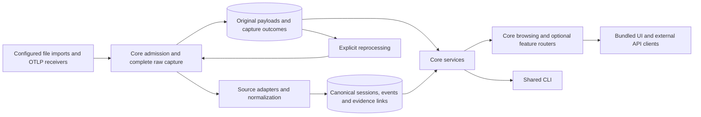

# Architecture

Implemented first-party architecture, reviewed 2026-09-08. The [principles](principles.md) guide tradeoffs; the [modular feature plan](modular-features-plan.md) records the design decisions. [Data lineage](data-lineage.md) defines mappings and [data-quality gaps](data-quality-gaps.md) limits their interpretation.

## Ownership and components

| Component | Responsibility |
| --- | --- |
| [Feature catalog](../backend/agentboard/features/catalog.py), [adapter catalog](../backend/agentboard/adapters/catalog.py) | Frozen first-party declarations, dependency validation, lazy factories. Metadata inspection opens no database or optional client. No dynamic module discovery. |
| [Runtime](../backend/agentboard/runtime.py) | Validate before storage construction; construct enabled adapters/services; own ingestion concurrency and resource cleanup. HTTP lifespan and CLI context manager both close the runtime, including failed construction. |
| [API](../backend/agentboard/api.py), [HTTP ingestion](../backend/agentboard/http_ingestion.py) | Own app, middleware, core routes, body limits, backpressure, errors, route ownership validation, and static UI. Features cannot contribute middleware, mounts, or lifecycle hooks through their router contract. |
| [Ingestion](../backend/agentboard/ingestion.py), [capture repository](../backend/agentboard/capture_store.py) | Commit complete original bytes before decoding/normalization. Track separate capture attempts and interpretation outcomes; support explicit reparsing. Core owns capture SQL and policy. |
| [Domain](../backend/agentboard/domain.py), [Codex adapter](../backend/agentboard/adapters/codex.py), [OTLP](../backend/agentboard/otlp.py) | Shared session/event contract and source-specific normalization. Unknown content remains in capture even if omitted from canonical events. Optional Codex field mapping is resolved at startup. |
| [Store](../backend/agentboard/store.py) | Core schema/migrations, canonical transactions, indexes, identity reconciliation, raw line archives and evidence links. SQLite is the only shipped backend; connections close after each operation. Streaming read connections permit sequential HTTP worker handoff; write connections retain thread affinity. |
| [Services](../backend/agentboard/services.py), [feature modules](../backend/agentboard/features/) | Each router receives a frozen set of named operations and relevant flags. No application, runtime, mutable registry, raw Store, or SQLite handle is passed to features. These are internal trusted-code interfaces, not a security sandbox. |
| [Parallel analysis](../backend/agentboard/parallel.py), [unified timeline](../backend/agentboard/unified.py), [usage](../backend/agentboard/usage.py) | Pure/on-demand derived analysis behind core services. Usage scans a retained rollout and keeps usage rows in memory; no materialized aggregate cache exists. |
| [Model gateway](../backend/agentboard/models.py), [prompts](../backend/agentboard/prompts/README.md), [resume](../backend/agentboard/resume.py) | Optional classification/replay; clients are scoped to calls. Native execution remains explicit CLI-only RPC. No ingestion-time model calls. |
| [Frontend](../frontend/) | Core owns markup, styling and navigation; one `/api/v1/config` catalog drives optional controls and requests. Static files ship in wheels; no frontend build/runtime dependency. |

## Capture, identity and transactions

The source/receiver allowlist determines what enters the service. Every supplied payload accepted from those sources is captured independently of optional analysis or inspection. `raw_archive` controls access only; `field_lineage` and `token_usage` can use core evidence without it. `features = []` keeps existing-data browsing without starting unconfigured collection. [Feature rules](features.md).

A raw capture transaction commits before lossy interpretation. Successful normalization commits canonical rows and Codex line archives separately; interpretation failure rolls those derived writes back while original bytes survive. Repeated payloads deduplicate bytes but record each attempt. `pending` means completion was not recorded, including interrupted processes; it is not proof of success or failure. [Exact formats, failures, retry and migration](data-lineage.md#35-raw-archive-and-export).

Schema v9 adds capture tables and preserves earlier archives without inventing past capture attempts or missing OTLP bytes. Normalization still uses existing IDs, mapping versions and reimport reconciliation; reprocessing does not universally replace conflicting history. [Identity and upgrade rules](data-lineage.md#8-identity-transactions-and-upgrades).

## Failure, load and lifecycle

HTTP holds at most the configured compressed body and bounded decoded body; default limit is 32 MiB and admission concurrency four per process. Unsupported media/encoding and oversized unaccepted bodies fail explicitly. Saturation returns 503 before reading a body. CLI snapshots each binary file to temporary disk and captures it in bounded chunks before parsing, so larger files need disk capacity but no full-file memory buffer. Parser pending-call state can still grow with the file.

Original capture commits use SQLite WAL with `synchronous=FULL`. Canonical data and outcome updates use `NORMAL`; after interruption they can be retried from retained bytes. Durability still depends on the filesystem/storage honoring SQLite synchronization. SQLite has one writer and a five-second lock timeout; contention returns retryable 503. No durable scheduler, automatic capture reprocessing, retention, or pruning exists. Successful Codex imports currently store both the transport payload and line archive; growing snapshots can multiply storage cost.

Core activates enabled routers in dependency order and rejects duplicate/unowned routes. Each service is built once per runtime; disabled factories do not run. Core's exit stack owns future long-lived resources; current database connections and model clients close within operations. Features change on restart.

Models use worker threads with configurable timeout, bounded text context, and no SDK retries. Classification records truncation; oversized replay fails. Historical imports add no agent-side hooks. Exporter retry/buffering belongs to the upstream SDK/collector; no agent-latency reduction is claimed.

## Performance and remaining limits

[Review measurements](architecture-review.md) compare fixed profiles before and after the refactor. They are a small retry workload, not a capacity certification. Representative growing datasets, optional-analysis load, export/tail latency, and numerical budgets remain unmeasured or unagreed. Complete capture cannot be traded away to improve these results.

This is one authenticated shared workspace, with plaintext storage and no tenant isolation. [Correctness gaps](data-quality-gaps.md) remain explicit: inferred input/timing semantics, unsupported-record reporting, conflicting-history corrections, cross-source lineage and reproducible analysis snapshots. Future first-party adapters or profiled component replacements should preserve capture and API contracts. Third-party packaging, RPC workers and larger service infrastructure remain [deferred](backlog.md).
