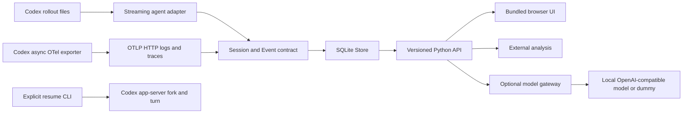

# Architecture

[Data lineage](data-lineage.md) specifies exact mappings and merge rules; [data-quality gaps](data-quality-gaps.md) identify limits on completeness, identity, and reproducibility.

## Boundaries

| Module | Responsibility and reason for separation |
| --- | --- |
| [`domain.py`](../backend/agentboard/domain.py) | Agent-neutral Pydantic session/event contract: source, timing quality, optional span hierarchy, text, attributes. No Codex-specific database columns. |
| [`adapters/codex.py`](../backend/agentboard/adapters/codex.py) | Incremental rollout normalization; isolates source-schema changes. Pending calls can grow with record count; the parser does not buffer the file. Unknown types are omitted from normalized events but retained in the raw archive. The stream includes `RawLine`/`RawTraceEnd` markers alongside `Session`/`Event` values; storage archives them in the same transaction. |
| [`otlp.py`](../backend/agentboard/otlp.py) | Protobuf/JSON validation and normalization; retains decoded record/resource/scope evidence. Separates transport measurements, output streaming, and estimated gaps. |
| [`store.py`](../backend/agentboard/store.py) | SQLite schema, indexes, transactions, cursors, grouped overlap aggregation, streaming reads. Keep SQL here so storage can change without rewriting routes/adapters. SQLite is the only shipped backend. |
| [`parallel.py`](../backend/agentboard/parallel.py) | Derives source/quality/turn/trace/parent-scoped tool-overlap groups from normalized intervals. Shared by API and UI; does not mutate events or require schema migration. |
| [`usage.py`](../backend/agentboard/usage.py), [`pricing.py`](../backend/agentboard/pricing.py) | Reads one immutable raw archive to derive usage and dated Standard API value. Prices use decimal arithmetic; no model calls, live pricing fetches, ingestion changes or schema migrations. Each report scans the archive and retains usage rows in memory; it does not cache or materialize aggregates. |
| [`api.py`](../backend/agentboard/api.py) | Shared routes, auth, host/origin checks, body limits, backpressure, configuration, plugin registration. CPU/DB/model work runs in worker threads. Acknowledgment follows commit under WAL/`synchronous=NORMAL`; power-loss durability follows SQLite NORMAL semantics. |
| [`models.py`](../backend/agentboard/models.py) | Optional OpenAI client, bounded transcript construction, validated classification, text replay. No ingestion-time model calls or tool execution. |
| [`resume.py`](../backend/agentboard/resume.py) | Explicit CLI-only Codex JSON-lines RPC over stdio. Neither modifies rollout files nor exposes remote command execution. |
| [`frontend/`](../frontend/) | Plain-JavaScript UI over the shared API; no separate frontend API/build pipeline. Source checkouts serve these files directly, and wheel builds bundle them as package data. Codex field origins and source pointers come from the backend lineage API; other-source descriptions remain display-time mappings. See [field lineage](data-lineage.md#36-per-field-codex-lineage). |

## Identity and ordering

Codex metadata or OTel correlation attributes identify sessions. Without tenant namespaces, all service users share data. Deterministic IDs deduplicate identical reimports and appended records: rollout IDs use session/line/discriminator; measured items use item ID; OTel spans use trace/span IDs; logs use decoded-record hashing. Sources remain separate. Exact fallback/hash/merge rules are in [lineage §8](data-lineage.md#8-identity-transactions-and-upgrades).

Reimport is not synchronization of rewritten history; use a new session identity for such history. Existing completed rows are generally unchanged. Database `row_id`, source `sequence`, and timestamps express ingestion, record, and temporal order respectively. Calls emit on result or unfinished at EOF, so these orders differ. Reimport can complete old open rows; advanced pagination cursors do not resend them.

## Failure and load behavior

HTTP buffers a bounded body, including gzip expansion; CLI imports stream larger files. Default ingestion concurrency is four per process. Saturation returns 503 before reading the body; SQLite lock timeout is five seconds, with retryable HTTP 503. A parse failure rolls back its file/batch. Envelope errors identify the line; deeper mapping errors may lack that context.

Historical imports install no hooks or watchers and add no instrumentation to the agent path. Reimport explicitly or use Codex's asynchronous OTel exporter. SDK exporters/collectors own retry and queue policies; AgentBoard makes no measured agent-latency improvement claim.

Model calls run synchronously in worker threads: 30-second request timeout, two-second discovery timeout, no SDK retries. The framework thread pool limits concurrency; there is no durable scheduler. Oversized replay contexts fail; classification records truncation. Expensive service workloads may use an optional job plugin, keeping queues unnecessary locally.

## Evolution without speculative infrastructure

1. Register another `parse(lines)` adapter through an enabled plugin.
2. Add optional analysis routes/plugins without changing ingestion or splitting the shared API.
3. For larger deployments, evaluate storage/migrations behind the same API. Before claiming multi-tenant readiness, address collector buffering, authenticated tenant IDs, quotas, retention, observability, and realistic load tests.
4. If profiling justifies it, replace normalization/ingestion/storage components in another language behind the existing contracts; keep classification/UI APIs independent.

These are extension paths, not selected implementations; see the [backlog](backlog.md). The initial version has no distributed tracing database, plugin marketplace, scheduler, custom agent SDK, or generalized workflow engine.
