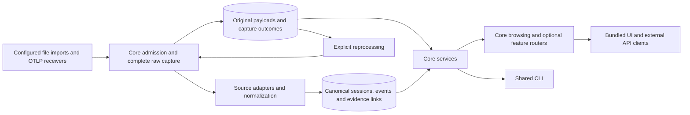

# Architecture

Current first-party architecture, reviewed 2026-09-26. The [principles](principles.md) guide tradeoffs; the [feature contract](features.md#first-party-module-contract) defines module interfaces. [Data lineage](data-lineage.md) defines mappings and [data-quality gaps](data-quality-gaps.md) limits their interpretation.

The [dataset curation module](dataset-curation.md) is an explicit experiment workflow. Its review API and UI operate on pinned archive inputs and locked mutable workspaces, independently of the trace Runtime. Human decisions export as new immutable datasets with full source references and removal markers. Workspace creation uses a configurable local Sentence Transformers encoder or remote embeddings API, then compares saved vectors with cosine similarity. Browsing and export never invoke a provider; the remote adapter transmits only normalized target user input and stores provenance without credentials.

```mermaid
flowchart LR
  C[Configured file imports and OTLP receivers] --> A[Core admission and complete raw capture]
  A --> R[(Original payloads and capture outcomes)]
  A --> N[Source adapters and normalization]
  N --> S[(Canonical sessions, events and evidence links)]
  R --> P[Explicit reprocessing]
  P --> A
  R --> V[Core services]
  S --> V
  V --> H[Core browsing and optional feature routers]
  H --> U[Bundled UI and external API clients]
  V --> L[Shared CLI]
```

## Design decisions

AgentBoard is a first-party modular monolith: trusted feature code ships in the same repository and release. A static catalog supports validation before storage opens and lazy construction of enabled services. Core owns the database, complete raw capture, UI, authentication, admission and lifecycle; features receive narrow named operations. These boundaries keep disabled work out of startup and avoid an external API compatibility promise.

Settings are process-wide and take effect after restart. No arbitrary module discovery, feature-owned migrations, UI injection, hot loading or extension process is implemented. Third-party distribution and process isolation remain [deferred](backlog.md#third-party-extensions); preserving an internal boundary does not commit to a public plugin API.

## Ownership and components

| Component | Responsibility |
| --- | --- |
| [Feature catalog](../backend/agentboard/features/catalog.py), [adapter catalog](../backend/agentboard/adapters/catalog.py) | Frozen first-party declarations, dependency validation, lazy factories. Metadata inspection opens no database or optional client. No dynamic module discovery. |
| [Runtime](../backend/agentboard/runtime.py) | Validate before storage construction; construct enabled adapters/services; own ingestion concurrency and resource cleanup. HTTP lifespan and CLI context manager both close the runtime, including failed construction. |
| [API](../backend/agentboard/api.py), [HTTP ingestion](../backend/agentboard/http_ingestion.py) | Own app, middleware, core routes, body limits, backpressure, errors, route ownership validation, and static UI. Features cannot contribute middleware, mounts, or lifecycle hooks through their router contract. |
| [Ingestion](../backend/agentboard/ingestion.py), [capture repository](../backend/agentboard/capture_store.py) | Commit complete original bytes before decoding/normalization. Track separate capture attempts and interpretation outcomes; support explicit reparsing. Core owns capture SQL and policy. |
| [Domain](../backend/agentboard/domain.py), [Codex adapter](../backend/agentboard/adapters/codex.py), [OTLP](../backend/agentboard/otlp.py) | Shared session/event contract and source-specific normalization. Unknown content remains in capture even if omitted from canonical events. Optional Codex field mapping is resolved at startup. |
| [Store](../backend/agentboard/store.py) | Core schema/migrations, canonical transactions, indexes, identity reconciliation, raw line archives and evidence links. SQLite is the only shipped backend; connections close after each operation. Streaming read connections permit sequential HTTP worker handoff; write connections retain thread affinity. |
| [Services](../backend/agentboard/services.py), [feature modules](../backend/agentboard/features/) | Each router receives a frozen set of named operations and relevant flags. No application, runtime, mutable registry, raw Store, or SQLite handle is passed to features. These are internal trusted-code interfaces, not a security sandbox. |
| [Parallel analysis](../backend/agentboard/parallel.py), [unified timeline](../backend/agentboard/unified.py), [usage](../backend/agentboard/usage.py) | Pure/on-demand derived analysis behind core services. Usage scans a retained rollout and keeps usage rows in memory; no materialized aggregate cache exists. |
| [Model gateway](../backend/agentboard/models.py), [prompts](../backend/agentboard/prompts/README.md), [resume](../backend/agentboard/resume.py) | Optional classification/replay; clients are scoped to calls. Native execution remains explicit CLI-only RPC. No ingestion-time model calls. |
| [Frontend](../frontend/) | Core owns markup, styling and navigation; one `/api/v1/config` catalog drives optional controls and requests. Static files ship in wheels; no frontend build/runtime dependency. |

## Capture, identity and transactions

The source/receiver allowlist determines what enters the service. Every supplied payload accepted from those sources is captured independently of optional analysis or inspection. `raw_archive` controls access only; `field_lineage` and `token_usage` can use core evidence without it. `features = []` keeps existing-data browsing without starting unconfigured collection. [Feature rules](features.md).

A raw capture transaction commits before lossy interpretation. Successful normalization commits canonical rows and Codex line archives separately; interpretation failure rolls those derived writes back while original bytes survive. Repeated payloads deduplicate bytes but record each attempt. `pending` means completion was not recorded, including interrupted processes; it is not proof of success or failure. [Exact formats, failures, retry and migration](data-lineage.md#35-raw-archive-and-export).

Schema v9 adds capture tables and preserves earlier archives without inventing past capture attempts or missing OTLP bytes. Normalization still uses existing IDs, mapping versions and reimport reconciliation; reprocessing does not universally replace conflicting history. [Identity and upgrade rules](data-lineage.md#8-identity-transactions-and-upgrades).

## Failure, load and lifecycle

HTTP holds at most the configured compressed body and bounded decoded body; default limit is 32 MiB and admission concurrency four per process. Unsupported media/encoding and oversized unaccepted bodies fail explicitly. Saturation returns 503 before reading a body. CLI snapshots each binary file to temporary disk and captures it in bounded chunks before parsing, so larger files need disk capacity but no full-file memory buffer. Parser pending-call state can still grow with the file.

Original capture commits use SQLite WAL with `synchronous=FULL`. Canonical data and outcome updates use `NORMAL`; after interruption they can be retried from retained bytes. Durability still depends on the filesystem/storage honoring SQLite synchronization. SQLite has one writer and a five-second lock timeout; contention returns retryable 503. No durable scheduler, automatic capture reprocessing, retention, or pruning exists. Successful Codex imports currently store both the transport payload and line archive; growing snapshots can multiply storage cost.

Core activates enabled routers in dependency order and rejects duplicate/unowned routes. Each service is built once per runtime; disabled factories do not run. Core's exit stack owns future long-lived resources; current database connections and model clients close within operations. Features change on restart.

Models use worker threads with configurable timeout, bounded text context, and no SDK retries. Classification records truncation; oversized replay fails. Historical imports add no agent-side hooks. Exporter retry/buffering belongs to the upstream SDK/collector; no agent-latency reduction is claimed.

## Performance and remaining limits

The dated measurements below cover a small retry workload, not production capacity. Complete capture cannot be traded away to improve these results. Current validation commands and required profiles live in the [testing guide](testing.md).

This is one authenticated shared workspace, with plaintext storage and no tenant isolation. [Correctness gaps](data-quality-gaps.md) remain explicit: inferred input/timing semantics, unsupported-record reporting, conflicting-history corrections, cross-source lineage and reproducible analysis snapshots. Future first-party adapters or profiled component replacements should preserve capture and API contracts. Third-party packaging, RPC workers and larger service infrastructure remain [deferred](backlog.md).

### Measurements

Historical benchmark, **2026-09-08**.

Recorded with `uv run --extra dev python examples/feature_benchmark.py --requests 20`. The [benchmark JSON](measurements/2026-09-08-feature-profiles.json) pins the measured source fingerprints and Python identity. The after measurement includes mandatory capture with SQLite `FULL` commits. These are historical measurements, not a benchmark of every subsequent change.

Environment: macOS ARM64, Python 3.13.3. Each profile starts a fresh process/database, using 20 repeats of the 5,408-byte synthetic Codex fixture and session-list reads in two worker threads. The empty profile reads an empty database. Startup measures app construction/lifespan after Python/module import, not whole-process cold start. The model profile enables all features with dummy mode and performs no model call. Measurements are single runs, sensitive to scheduling/cache noise.

Values are **before → after**:

| Profile | App startup ms | Import median ms | Query p95 ms | Repeated input bytes/s | Peak RSS MiB | DB/disk bytes |
| --- | --- | --- | --- | --- | --- | --- |
| Empty | 28.77 → 19.06 | — | 2.66 → 2.40 | — | 56.59 → 55.12 | 118,784 → 135,168 |
| Import only | 28.77 → 21.37 | 7.16 → 7.42 | 4.65 → 3.38 | 640,909 → 658,732 | 58.20 → 55.84 | 126,976 → 159,744 |
| Default tracing | 31.85 → 26.14 | 11.50 → 11.28 | 3.75 → 3.92 | 363,263 → 444,112 | 58.80 → 56.91 | 262,144 → 282,624 |
| Model features | 37.68 → 30.92 | 11.22 → 11.83 | 3.43 → 3.23 | 428,433 → 418,810 | 59.48 → 57.41 | 262,144 → 282,624 |

CPU seconds for the same runs: empty 0.050 → 0.040; import-only 0.202 → 0.193; default 0.327 → 0.275; model profile 0.298 → 0.295. The JSON also records medians, wall time and inserted counts. Each ingestion profile inserts 24 unique events; repeated-input throughput is mostly deduplicated retries, not sustained unique-event capacity.

The old import-only profile retained **zero** full source bytes, so it is not an equivalent completeness/durability workload. All new ingestion profiles retain the full 5,408-byte source plus attempt metadata; successful Codex imports also keep the line archive for evidence indexing. Storage increased, while startup decreased in these runs. This does not establish a statistically significant overall speedup.

PERF-01 remains partially verified. Still needed: agreed throughput/latency/resource budgets, growing representative datasets, existing-data empty-profile timing, sustained concurrent writes/reads, stats/export tail latency, filesystem write volume, optional-analysis load and upstream agent overhead. One SQLite writer, full snapshot storage, duplicate transport/line archives, uncached usage/unified scans and parser pending state are concrete scaling costs. Measure these before selecting lossless storage optimization, materialization or another implementation language.

## Experiment storage

**Filesystem implemented — 2026-09-25.** Explicit scripts use the [experiment recorder](../backend/agentboard/experiments/archive.py); separate CLI commands discover, verify and analyze portable bundles outside checkouts. They do not construct the trace runtime or modify its SQLite Store. Optional publication to self-hosted MLflow, PostgreSQL metadata and server artifacts remains planned. The [experiment storage design](experiment-storage.md) owns component boundaries, the artifact contract, synchronization, and migration. [Specification §15](specification.md#15-durable-experiment-storage) owns requirements and acceptance criteria.

The independent [classifier experiments](../cronjob/classifier/README.md) live under `cronjob/classifier/` with per-model training scripts and dataclasses, a data/inference utility CLI, dependencies and tests. They are not an AgentBoard application component; only explicit recording reuses the existing archive API.
