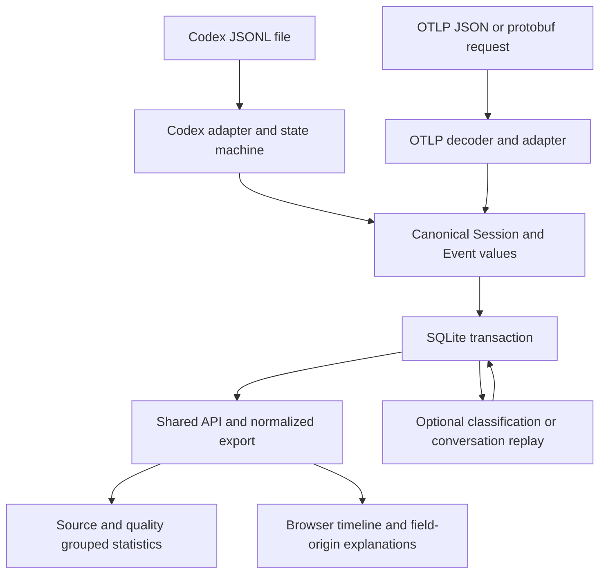

# Data lineage and transformation rules

Reviewed against the working source on **2026-09-06**. Canonical storage schema: **v6**. API: **`/api/v1`**.

How AgentBoard obtains, transforms, stores, and presents data, including interpretation and information loss. This documents **current implementation**, not the upstream Codex format or universal release compatibility. New Codex archives record mapping version `codex-jsonl-v3`; earlier normalized rows have no persisted mapping version.

Related: [requirements](specification.md), [architecture](architecture.md), [current correctness gaps](data-quality-gaps.md), and [deferred capabilities](backlog.md).

## 1. What a consumer can conclude

AgentBoard supports exploratory analysis, not independent reproduction of every field from retained raw evidence. Successful import establishes a committed transaction—not complete format/operation coverage or human authorship of every `user` event.

| Data | Supported interpretation | Interpretation not established |
| --- | --- | --- |
| Normalized source timestamp | The source supplied this instant, after documented format conversion. | The instant is necessarily the start/end of model computation; the source clock is accurate. |
| Historical LLM interval | A positive gap selected by the rollout state machine. | Actual model latency, GPU execution time, or complete LLM utilization. |
| Historical tool interval | Time between a call record and a paired result record, with possible clamping. | Pure tool execution time or completion of a process that yielded asynchronously. |
| Codex item timing | Reported duration or item lifetime. | Full model latency for an output-streaming item. |
| Between-turn wait | Time from a final/completion marker to the next recognized prompt. | Time actively spent considering a question; necessarily waiting for a human. |
| `kind=user` | A record matched a user-message mapping. | Verified human authorship. |
| `status=ok` | No mapped error condition was found, or the adapter used its default. | Correct task result, successful evaluation, or calibrated confidence. |
| Classification | A model result, dummy rule, or externally submitted label. | Ground truth or a reproducible evaluation experiment. |

Choose metrics supported by their evidence. Keep source, timing quality, completeness, and model/dummy identity visible; never combine unlike timing sources to rank performance.

## 2. The data path



| Stage | Implementation | Important boundary |
| --- | --- | --- |
| File discovery and import summary | [`cli.py`](../backend/agentboard/cli.py), `main` | Directory search finds `*.jsonl`; one transaction per file. Glob selection is performed by the shell when supplied that way. |
| HTTP import and OTLP receive | [`api.py`](../backend/agentboard/api.py), `bounded_body`, `ingest`, `otlp` | Buffers a bounded request; decoding/ingestion runs in a worker. HTTP paths do not read arbitrary server file paths. |
| Historical normalization | [`adapters/codex.py`](../backend/agentboard/adapters/codex.py), `CodexAdapter.parse` | Parses file order with pending calls and turn state; never executes command text. |
| Telemetry normalization | [`otlp.py`](../backend/agentboard/otlp.py), `decode`, `normalize` | Preserves selected decoded evidence, not original wire bytes. |
| Domain and timestamp validation | [`domain.py`](../backend/agentboard/domain.py), [`timestamps.py`](../backend/agentboard/timestamps.py) | Common event kinds, timestamps, and interval validation. This is not complete validation of every upstream payload variant. |
| Identity, merging, aggregation | [`store.py`](../backend/agentboard/store.py), `ingest`, `stats` | Archives complete accepted Codex JSONL versions; no cross-source semantic deduplication. |
| Model operations | [`models.py`](../backend/agentboard/models.py) | Explicit optional operations; importing a trace never calls a model. |
| Display and provenance | [`static/app.js`](../frontend/app.js), [`static/provenance.js`](../frontend/provenance.js) | Descriptions are computed from stored source/kind/attributes at display time. |

## 3. Raw Codex files

The accepted [compatibility policy](specification.md#35-codex-rollout-compatibility-policy) governs retention, version attribution, unsupported records, and semantic interpretation. The mappings below describe current implementation.

### 3.1 Envelope and observed variants

Rollouts are UTF-8 JSON Lines: one object per nonblank line, processed in file order without timestamp sorting. The one-based line counter includes skipped blank lines.

The general shape consumed by the adapter is:

```json
{
  "timestamp": "2026-09-06T08:51:24.032Z",
  "type": "event_msg",
  "payload": {
    "type": "user_message",
    "message": "Example prompt"
  }
}
```

Outer `type` and `payload.type` are separate discriminators. The outer timestamp dates the record; it does not necessarily measure an operation boundary.

The [synthetic fixture](../examples/fixtures/codex-session.jsonl) provides complete shareable examples, not evidence of real session activity. The separately labeled [redacted real excerpt](../examples/fixtures/codex-real-excerpt.md) preserves selected recorded structures and timings from CLI 0.153.4; its provenance documents omissions, redactions, and original line numbers.

A read-only inspection of a real session (pseudonymized here as `reviewed-session`) confirmed these shapes:

| Physical line | Outer timestamp | Outer / payload type | Relevant observation |
| --- | --- | --- | --- |
| 1 | `2026-09-06T08:51:22.805Z` | `session_meta` / absent | Metadata included both IDs, a nested timestamp, version/context/git/source fields, and base instructions. All payload fields now enter session metadata, and the full envelope is archived. |
| 8 | `2026-09-06T08:51:24.032Z` | `event_msg` / `user_message` | Contains `message` and additional audio/image/text-element fields. Only message text is used for this mapping. |
| 9 | `2026-09-06T08:51:26.870Z` | `response_item` / `reasoning` | Contains summary and encrypted-content fields. The adapter extracts summary text; it does not decrypt content. Encrypted content is preserved in the raw archive. |

That file also contained unmapped outer `world_state`/`token_usage_record` and inner `agent_message`/`thread_settings_applied` types. This single-file observation is not a format catalog. Private prompts and encrypted content are omitted.

### 3.2 Session and context mapping

| Raw location / condition | Stored value / behavior |
| --- | --- |
| First usable `session_meta.payload.id`, otherwise `payload.session_id` | `Session.id`; a nonempty string is required. A different session ID later in the same file rejects the import. |
| `session_meta.timestamp` on the **outer envelope** | `Session.started_at`, normalized to UTC. The nested `payload.timestamp` is not used. |
| Agent default | `Session.agent = "codex"`. |
| Entire `session_meta.payload` | Copied into session metadata, including IDs, base instructions, git, `thread_source`, unknown fields, and nested structures. Store merging still uses `json_patch`; exact original values, including nulls, remain in the archive. |
| `turn_context.payload.turn_id` | Becomes current turn ID; absent key leaves the previous value. |
| Truthy `turn_context.payload.model` | Updates session metadata's `model`; subsequent updates replace it. No per-event model history is retained. |
| First recognized prompt while title is `Untitled session` | Strip text, take first line, truncate to 100 characters; blank falls back to `Untitled session`. The title is an application choice. |

Session metadata must precede other records. Repeated same-ID metadata rebuilds the parser’s Session object; section 8 defines store merging.

### 3.3 Record-to-event mapping

The table describes the normalized view. Every source field and line also survives independently in the raw archive (§3.5).

`end_time` is null unless the rule explicitly creates a closed interval. Most message/lifecycle events retain the default `timing=unknown` and `status=ok`.

| Outer / payload type | Mapping | Retention / caveat |
| --- | --- | --- |
| `event_msg` / `task_started` | Updates current turn, enables LLM-gap tracking, sets anchor to outer timestamp. | Does not emit a start-marker event. |
| `response_item` / `message`, role `user` | Emits `kind=user`, name `User input`; may close a wait. | Joins content text. Role is not an authorship check. |
| `event_msg` / `user_message` | Creates a pending fallback user event unless it matches the remembered user text; may close a wait. | Extracts `payload.message`; prompt mirrors are handled as below. |
| `response_item` / `function_call` or `custom_tool_call` | Opens pending `tool` or blocking `user_wait`; may first emit an estimated LLM gap. | Name, call key, arguments/input text retained. Event emitted on result or EOF. |
| `response_item` / `function_call_output` or `custom_tool_call_output` | Pairs with pending call by `payload.call_id`, closes interval, attaches output. | Unmatched output emits an `event` named `Unmatched tool output`, `status=incomplete`. |
| `response_item` / `message` or `reasoning`, excluding user branch and system/developer roles | May emit an LLM gap, then emits `assistant` named `Assistant` or `Reasoning summary`. | Extracts `content`, otherwise `summary`. Missing/empty text can remain empty. |
| Above with `payload.phase=final_answer` | After emitting, disables LLM-gap tracking and starts a possible wait. | This condition is literal; it is not inferred from the text. |
| `event_msg` / `task_complete` | Flushes fallback prompt, remembers previous completed turn, disables LLM-gap tracking, starts possible wait; emits lifecycle `event`. | Does not close a final LLM gap by itself. |
| `event_msg` / `turn_aborted` | Flushes fallback prompt, disables gap tracking and clears wait; emits lifecycle `event`, `status=interrupted`. | Does not clear pending tool calls. |
| Outer `compacted`, or `event_msg` / `thread_rolled_back` | Emits lifecycle `event` with full payload in `attributes`; clears active/anchor/wait state. | Does not apply rollback to earlier stored events; pending calls are not cleared. |
| `event_msg` / `token_count` | Emits `event`, name `Token usage`, `attributes.info=payload.info`. | Preserves reported info; no canonical token total, cost, or counter/delta interpretation. |
| `event_msg` / `item_completed` | Emits a separate measured item event when recognized and both timing fields exist. | See section 5. |
| Valid but otherwise unhandled record | No event emitted. | Preserved in the raw archive; no skipped-type count or warning. |

All nonblank records undergo JSON/payload/timestamp access before type selection, so even an ignored malformed record can reject the file. Envelope errors identify the line; deeper mapping errors may not.

### 3.4 Text and mirror rules

`content_text` preserves strings or concatenates dictionary elements’ `text` fields with **no separator**. It ignores non-dictionary elements and does not inspect content-part type. Images, audio, encrypted reasoning, rich text-element metadata, and parts without text are not reconstructed.

A response-item user message is emitted immediately. Its text is remembered as `seen_user`. An event-message mirror with exactly equal text is suppressed. A differing event-message prompt becomes `fallback_user`; an older pending fallback is emitted first. A later response-item prompt discards an equal fallback or emits a differing fallback. Remaining fallback is flushed on completion, abort, or EOF. Repeated response-item prompts are retained.

**Timing consequence:** a suppressed mirror still moves the active anchor, so the next LLM interval may start at its timestamp rather than the stored user event’s. Matching uses text/state, not source-message identity; it is not general semantic deduplication.

For call arguments, the adapter stores `str(payload.arguments)` or, if the key is absent, `str(payload.input)` with an empty default. A structured value here is Python's string representation, not guaranteed JSON. Tool output stays unchanged when already a string; other outputs use `json.dumps`.

Measured item commands use a separate conversion: strings unchanged; all-string arrays use `shlex.join`; null becomes empty; other structures use JSON serialization. No imported command is executed.

### 3.5 Raw archive and export

Implemented **2026-09-06** in [adapter](../backend/agentboard/adapters/codex.py), [storage](../backend/agentboard/store.py), [API](../backend/agentboard/api.py), and [CLI](../backend/agentboard/cli.py). Accepted UTF-8 Codex JSONL imports retain every input line as UTF-8 bytes in `raw_lines`, keyed by archive ID and one-based physical `sequence`. This includes blank lines, original timestamp spelling, whitespace, line endings, absent final newline, unknown fields/types, system/developer messages, content parts, and encrypted content. The archive does not decrypt, execute, redact, or normalize these bytes. HTTP gzip input archives the decompressed JSONL, not its compressed transport envelope. Invalid imports roll back both archive and normalized changes.

`raw_imports` records session ID, SHA-256 of concatenated source bytes, byte/line counts, archive creation time, and mapping version `codex-jsonl-v3`. Identical session/hash/mapping imports reuse an archive ID. Changed, appended, or shortened files create distinct archives and preserve prior versions. Latest means the most recently created distinct archive, not the longest file or most recent identical retry. Each distinct snapshot stores all its lines; storage grows with retained versions and has no automatic pruning.

`GET /api/v1/sessions/{sid}/raw-imports` lists archive metadata. `/raw?import_id=ID` exports one exact version; omitting the ID selects the latest. The UI's **Export raw trace** uses that default. CLI equivalents are `agentboard export SESSION_ID --raw [--import-id ID]`. Existing `/export` and input exports remain normalized. Import responses include `raw_import_ids`. No available source returns an empty version list and a 404 raw export, never reconstructed evidence.

**Event source links — Implemented 2026-09-06:** schema v6 stores each verified event's archive ID and physical source-line numbers separately in `event_raw_sources`. `GET /api/v1/sessions/{sid}/events/{event_id}/raw` returns archive metadata and exact line text. The inspector offers **Table / Normalized JSON / Raw JSONL**, retaining the selection across events and reloads.

A message or completed item links to its source record; a completed tool links to call and result, which supply its arguments and output. Unified rows fetch both underlying events’ links. Inferred LLM gaps and between-turn waits have no actual event record: Raw JSONL reports this explicitly and excludes records used only to calculate duration. This exclusion also applies to boundary links saved by earlier versions, without reimporting. Recorded `codex_item` LLM events retain their actual item record. These are event-record links, not per-field lineage; session and propagated turn context can come from earlier lines.

Links are created only when the newly parsed normalized event equals the stored event. Identical retries retain links; conflicting or shortened snapshots do not redirect existing evidence to the latest archive. Completion updates replace links when the resulting event matches; hybrid events combining older content with changed timing lose their link rather than claim an incorrect source. Existing archives are not automatically reparsed during migration. Reimport original rollouts to backfill matching events; mismatched legacy events remain unavailable. OTLP and replay report that they have no Codex JSONL source. [Source-link tests](../backend/tests/test_event_raw.py) cover exclusion of inferred boundaries (including older links), actual LLM items, delayed prompts, version binding, completion, hybrid updates, legacy backfill, and unified items.

Schema v3 adds the archive tables without reconstructing old evidence. Reimport original files to backfill older sessions and metadata. Archive retention covers successful Codex JSONL imports; OTLP still retains selected decoded evidence rather than complete wire bytes. Exact round-trip, changed/shortened retry, rollback, CLI newline preservation, and migration coverage: [synthetic tests](../backend/tests/test_raw_traces.py).

## 4. Historical interval state machine

### 4.1 LLM gaps (`source=codex_jsonl`)

An interval is emitted only if all four conditions hold: `active` is true, an anchor exists, no calls are pending, and the triggering timestamp is later than the anchor.

The trigger is a tool call, assistant message, or reasoning record. The emitted values are:

- `kind=llm`, name `LLM response (estimated)`, `timing=estimated`.
- `start_time=anchor`, `end_time=triggering record timestamp`.
- `attributes.basis="gap between rollout items; includes orchestration"`.
- Empty text; the separately emitted assistant event may contain text.

| Transition | Anchor/active behavior |
| --- | --- |
| Task start or either recognized prompt form | Activate; anchor becomes that timestamp. |
| Opening a tool call | After any gap emission, clear anchor; put call in pending dictionary. |
| Tool output | Anchor becomes output timestamp only if active and no calls remain; otherwise null. |
| Assistant/reasoning | After any gap emission, anchor becomes that timestamp if active. |
| Final answer, completion, abort, compaction, rollback | Deactivate and clear anchor. |

These intervals are not an exhaustive, mutually exclusive activity partition. Missing responses leave work unrepresented; missing results suppress later LLM estimates, even across turns. Equal/backward gaps are omitted without anomaly reporting. EOF or completion alone creates no final LLM interval.

### 4.2 Tool calls and blocking input requests

A call key is selected as `payload.call_id or payload.id or str(line_number)`. The pending dictionary is keyed only by that value. A duplicate pending key overwrites the prior call; a result lacking the matching key cannot recover it.

On a matched result:

```text
start_time = call record timestamp
end_time   = max(result record timestamp, start_time)
duration   = end_time - start_time
```

Pairing two source timestamps is application logic. `timing=estimated` allows scheduling, approvals, and delivery overhead. Backward results set `attributes.end_time_clamped=true`; their end is Calculated and the original result timestamp is lost.

The output is searched for `Wall time: <number> seconds` (case-insensitive). The number is parsed as a float and multiplied by 1,000 into `reported_wall_time_ms`. This field does **not** replace the interval used in statistics. It can describe one yielded call rather than the eventual process lifetime. Error status is inferred from a positive nonzero exit-code text pattern; other error formats may leave the default `ok`.

At EOF, pending calls emit `status=incomplete`, `end_time=null`, and default `timing=unknown`. Their duration is unavailable, not zero. Reimport can complete those rows.

A name whose last dot-separated component is exactly `request_user_input` maps to `kind=user_wait`, `attributes.wait_type=input_request`. `request_user_input_async` remains a tool: its immediate return does not measure how long a user takes to answer. The blocking lifetime includes delivery overhead and is not proof that a human actively interacted throughout it.

### 4.3 Between-turn waits

`waiting_since` is set by a final-answer marker and then, if present, overwritten by the later task-complete timestamp. The next recognized prompt consumes it. A strictly later prompt emits:

```text
source = codex_jsonl
kind = user_wait
timing = estimated
start_time = waiting_since
end_time = prompt timestamp
attributes.wait_type = between_turns
attributes.basis = turn completion to next user prompt; may include idle time
```

Calls, assistant/reasoning records, aborts, compaction, and rollback clear the pending wait. Task start alone does not. No wait is emitted before the initial prompt or extended from the final completion to the present. A nonpositive gap emits no wait. Prompt mirrors consume the same wait only once.

Current turn ID comes from parser state at emission, usually the upcoming turn when its context/start has already arrived. User events separately carry `attributes.previous_turn_id`, updated only by completion. Neither field proves human authorship.

### 4.4 Parallel tool groups

Implemented **2026-09-06** as a derived view in [parallel.py](../backend/agentboard/parallel.py), [Store.parallel_groups](../backend/agentboard/store.py), and the timeline/inspector. `GET /api/v1/sessions/{sid}/parallel-groups?source=codex_jsonl` returns `items`, `scope=full_session_source`, and a method explanation. Omit `source` to inspect all sources separately. Search and event pagination do not alter membership or labels.

| Rule / field | Mapping and meaning |
| --- | --- |
| Eligibility | Normalized `kind=tool`, with both endpoints and `end_time > start_time`. Exclude user waits, LLM intervals, open operations, and zero-length/clamped intervals. |
| Group scope | Partition by session, source, timing quality, turn ID, trace ID, and parent span ID. Missing IDs remain null; do not infer relationships. Known parent/child spans are separated by their parent IDs. |
| Membership | Sort by start/end/event ID. Join intervals with positive overlap into a connected group of at least two tools. Treat intervals as half-open: touching endpoints do not overlap. Chains may contain members that never overlap each other. Membership and the interpretation “parallel” are **Inferred**. |
| `id`, `method`, `label` | ID is **Calculated** with `stable_id("tool-overlap-v1", scope, sorted_member_ids)`. Method identifies this grouping rule. Labels `P1`, `P2`, etc. follow chronological group order within each source; the UI displays “Parallel P1”. |
| `event_ids`, `tool_count` | Normalized event IDs in chronological order and their **Calculated** count. Repeated tool names remain distinct by ID. |
| `start_time`, `end_time` | Earliest member start and latest member end, using the stored RFC 3339 endpoint values. Interpreting them as group boundaries is an inference. |
| `max_concurrency` | **Calculated** maximum number of simultaneously overlapping member intervals. Process all changes at the same instant together. |
| `overlap_ms` | **Calculated** union of time with at least two member intervals active, in milliseconds. Triple overlap is counted once. Arithmetic uses integer nanoseconds before conversion. |
| `origin`, `timing` | Group `origin=inferred`; member timing quality is preserved separately. Measured interval endpoints do not prove simultaneous process execution or membership in one model-request batch. |

Synthetic example: A=[0,3), B=[2,5), C=[4,7) seconds produces one group with three tools, peak concurrency 2, and `overlap_ms=2000` from [2,3) and [4,5). A=[0,2), B=[2,4) produces no group.

Groups are recomputed from a single query over existing stored tools; no migration or reimport is needed. Source events, normalized exports, raw archives, and timing totals are unchanged. IDs remain stable while scope and membership remain the same; new/completed/changed intervals can merge groups or renumber labels. This is not a frozen analysis snapshot. The UI shows source-wide group counts and marks partial membership when filtering or pagination hides members. The inspector exposes derived membership separately from the normalized source event.

Limitations: missing parent metadata can make nested operations look parallel; missing results can hide real overlap. The grouping does not recover nested calls absent from the normalized source, establish exact process lifetimes, or identify explicit model-request batches. A zero group count means no qualifying overlap was found, not proof of sequential execution. Coverage: [synthetic tests](../backend/tests/test_parallel.py) include chains, triple overlap, boundaries, nanoseconds, scope separation, pagination/filter stability, and growing imports.

## 5. Measured Codex items (`source=codex_item`)

Items are a separate source from the same JSONL file; they neither replace nor deduplicate gap/call estimates.

A synthetic example of the consumed payload is:

```json
{
  "timestamp": "2026-09-06T08:51:26.870Z",
  "type": "event_msg",
  "payload": {
    "type": "item_completed",
    "turn_id": "example-turn",
    "started_at_ms": 1788684684032,
    "completed_at_ms": 1788684686870,
    "item": {
      "type": "CommandExecution",
      "id": "example-command",
      "command": ["/bin/zsh", "-lc", "echo hello"],
      "exit_code": 0,
      "duration": {"secs": 2, "nanos": 100000000}
    }
  }
}
```

| Input / rule | Result |
| --- | --- |
| Item type `CommandExecution`, `McpToolCall`, `FileChange`, `DynamicToolCall` | `kind=tool`, unless the blocking-input rule changes it to `user_wait`. |
| Item type `Reasoning`, `AgentMessage` | `kind=llm`; item lifetime measures output streaming, not full request latency. |
| Other type, or missing/null `started_at_ms` or `completed_at_ms` | No measured event. Even reported duration alone is insufficient for the current gate. |
| No tool duration dictionary | Start/end are payload millisecond fields multiplied by 1,000,000 then formatted as RFC 3339; both Normalized. |
| Tool duration dictionary | End comes from `completed_at_ms`; start is end minus `(secs × 1,000,000,000 + nanos)`, hence Calculated. Missing duration components default to zero. |
| `item.tool`, otherwise `item.type` | Event name. |
| `payload.turn_id`, otherwise current turn | Event turn ID. |
| Nonzero/non-null exit code, or `item.status=failed` | `status=error`; otherwise `ok`. |
| Entire `payload.item` | Preserved in `attributes.item`, plus AgentBoard `basis` and optional `wait_type`. |

In the example, the reported 2.1-second duration produces `start_time=2026-09-06T08:51:24.770000000Z`, overriding the supplied started-at instant. End stays `2026-09-06T08:51:26.870000000Z`.

`attributes.item` omits the envelope and payload timing fields: it can explain a duration method without independently proving the end timestamp. Timing components use integer coercion, not complete upstream numeric-schema/range validation.

## 6. Canonical field dictionary and provenance

### 6.1 Timestamp contract

`Session.started_at`, `Event.start_time`, and nullable `Event.end_time` use UTC RFC 3339 strings with exactly nine fractional digits in domain objects, SQLite TEXT columns, HTTP results, and normalized exports. Example: `2026-09-06T08:51:24.032000000Z`.

Normalize known offsets to UTC and pad fractions without losing nanoseconds. Support starts at the Unix epoch and ends at Python’s calendar limit. Reject leap seconds, unknown `-00:00`, missing timezones, and more than nine fractional digits. Integer conversion avoids floating-point rounding; padding does not imply nanosecond source resolution.

Fixed UTC/precision permits chronological string comparison; constructors reject end-before-start. Conversion, subtraction, and unions use temporary integer nanoseconds. Millisecond aggregates are floating-point JSON, not exact nanosecond interchange. Retained raw timestamps keep their source format.

### 6.2 Origins and timing quality are separate axes

| Origin | Meaning and examples |
| --- | --- |
| **Normalized** | Extracted, selected, propagated, decoded, or reformatted: session ID, source timestamps, imported text, retained item object. |
| **Calculated** | Computed from other values: duration, start derived from end/duration, stable hash, line counter. |
| **Inferred** | Internal application logic: operation category, quality label, display fallback, default status, explanation, SQLite-assigned row ID. This label does not necessarily mean uncertain. |
| **Model-generated** | Actual ML/LLM/agent output created during an AgentBoard model operation. |
| **Unavailable** | No usable stored value. Zero and false are values; null/undefined/empty text are normally unavailable, except an explicitly described empty placeholder. |
| **Unknown** | Evidence/mapping is insufficient to assign an origin. |

Imported assistant text is Normalized: this axis describes how **AgentBoard** obtained it, separately from who originally authored it. New model replay text is Model-generated; supplied/retained replay text is Normalized; dummy output is Inferred. Older replay output without explicit evidence remains Unknown.

`timing=measured` means the mapping used explicit item/span timing or a reported duration/local replay clock. `estimated` means rollout-gap or call/result pairing. `unknown` means no supported closed timing method. These are method classifications, not probability scores. The `timing` field's own origin is Inferred because AgentBoard assigns that label.

The JavaScript inspector derives origins from source, kind, attributes, and retained evidence. The backend neither persists nor returns a complete field-origin/method-version/source-pointer map. UI changes can relabel old events without reimport. Ambiguous fallback names and old zero-length tool intervals may be Unknown.

### 6.3 Event and attribute dictionary

| Field | Current derivation |
| --- | --- |
| `id` | Stable hash; recipes in section 8. Does not prove content integrity. |
| `row_id` | SQLite-assigned ingestion cursor, scoped to this database. |
| `session_id` | Rollout metadata ID; telemetry correlation/fallback; replay-derived session hash. |
| `sequence` | Rollout physical emission line; OTLP zero-based index within each scope's record list; replay message/event index. Not globally comparable across sources. |
| `kind` | Adapter's category, from rules in sections 3–5 and 9. |
| `name` | Copied source tool/item/event name where available, otherwise assigned display label. |
| `start_time`, `end_time` | Source instants or calculations described for each timing method; absent end is null. |
| `timing` | Assigned measured/estimated/unknown method label. |
| `source` | Assigned `codex_jsonl`, `codex_item`, `otlp_trace`, `otlp_log`, or `replay`. Plugin sources need their own mapping documentation. |
| `turn_id` | Current/explicit Codex turn or OTel `turn.id`; absent replay turn stays null. Propagation is not a raw turn ID on every record. |
| `trace_id`, `span_id`, `parent_span_id` | Decoded OTel relationships when present; normally null for rollout/item/replay. |
| `status` | Default or adapter error/lifecycle mapping. No correctness score. |
| `text` | Prompt, assistant summary/content, command/arguments, unmatched output, OTel body/prompt, replay text, or empty placeholder. |
| `attributes` | Extensible JSON; mappings below. Arbitrary keys do not automatically acquire reliable provenance. |

| Source / attribute | Derivation |
| --- | --- |
| Rollout `call_id` | Selected call key, possibly the application line-number fallback. The current inspector's generic Normalized description does not distinguish all fallback cases. |
| Rollout `output` | Result payload output, optionally JSON-serialized. |
| Rollout `previous_turn_id` | ID propagated from last observed completion. |
| Rollout `info` | Token-count payload's info object; no aggregation. |
| Rollout `reported_wall_time_ms` | Parsed seconds × 1,000; Calculated and independent of timing totals. |
| Rollout `end_time_clamped` | Application flag that a backward result was clamped. |
| Rollout/item `basis`, `wait_type` | Application method explanation and wait category; Inferred. |
| Compaction/rollback attributes | Entire payload copied; some keys have no inspector-specific mapping and appear Unknown. |
| Item `item` | Preserved source item object, Normalized. |
| OTel flattened attributes / `otel` | Merge and retained decoded evidence described in section 9. |
| Replay `retained_context`, `dummy`, `content_origin` | Application annotations; real new output uses `content_origin=model_generated`, dummy output `inferred`. |

### 6.4 Worked historical example

The observed line 8 timestamp became the anchor. At line 9 the reasoning record triggered a gap. Event and session IDs below are pseudonyms:

```json
{
  "id": "reviewed-llm-event",
  "session_id": "reviewed-session",
  "sequence": 9,
  "kind": "llm",
  "name": "LLM response (estimated)",
  "start_time": "2026-09-06T08:51:24.032000000Z",
  "end_time": "2026-09-06T08:51:26.870000000Z",
  "timing": "estimated",
  "source": "codex_jsonl",
  "text": "",
  "attributes": {"basis": "gap between rollout items; includes orchestration"}
}
```

This normalized excerpt has Normalized endpoints, Calculated `duration_ms = 2,838` and hash, and Inferred LLM interpretation/name/quality/basis. Empty text is an Inferred placeholder, not decrypted reasoning. Duration is inspector-derived, not a stored Event column.

## 7. Aggregation, API, and UI semantics

Statistics operate on stored events for one session, optionally one source. Timing groups are separate `(source, kind, timing)` triples for `llm`, `tool`, and `user_wait`.

```text
sum_ms    = sum(end_i - start_i for closed intervals) / 1,000,000
active_ms = length(union of closed intervals in this group) / 1,000,000
elapsed_ms = (latest coalesce(end_time, start_time) - earliest start_time) / 1,000,000
```

Using integer nanoseconds, sort by start/end, merge overlapping/touching runs, and sum their lengths. For `[0,10]` and `[5,15]` milliseconds: sum 20 ms, active 15 ms.

| Detail | Behavior |
| --- | --- |
| Open intervals | Included in event/group counts; excluded from both duration calculations. If there are no closed intervals in a group, both duration values are null. |
| Zero-length closed interval | A known zero duration, distinct from null. |
| Empty session/source selection | No timing groups; elapsed is 0 by API convention, not evidence of measured zero activity. |
| Session elapsed | Uses all event kinds for the selected source, includes gaps, and treats an open event as a point at its start. Does not extend to now or necessarily begin at session metadata's start. |
| Group combination | No automatic union across kinds, qualities, or sources. Never add duplicate representations of an operation. Even blocking and between-turn waits share a group when source/kind/quality match. |
| Counts | Stored normalized events, not raw line counts, requests, tokens, verified human prompts, or successfully completed tasks. |
| Search | Event text/name filter affects event pages; stats endpoint only accepts source, not text/kind search. Cards can describe more events than the filtered list. |
| UI timing cards | Use `active_ms`, selecting measured group before estimated when both exist. They do not add these groups; the UI indicates that estimates also exist. |
| UI timeline | `events?timeline=true` includes `llm`, `tool`, and `user_wait` plus any event with a recorded end before the row-ID cursor and page limit; default page size 200. Loaded events are sorted by start. Relative scale covers loaded events, while stats cover the full selected source. Internal timed spans use neutral styling and remain outside the LLM/tool/wait cards and parallel groups. Untimed other events remain in All events and exports. |
| Display precision | Timeline/labels round duration for readability; exact canonical timestamps remain in JSON. Local date labels use browser timezone; stored timestamps remain UTC. |
| Export | All sources unless consumer filters afterward; HTTP supports `kind`, not `source`, on export. Normalized event JSONL, not original raw lines or a full metadata/classification backup. |

Events paginate by increasing `row_id`; `after` is exclusive. Reimport updates to old rows are not resent by advancing this cursor. A replay uses `sequence,row_id` order to reconstruct prior context. An inferred interval's line number belongs to its triggering record; a tool's line number belongs to its opening record even when it is emitted later. These orders must not be conflated.

Reads are not frozen snapshots. Pages and queries can observe different writes; `stats` itself runs multiple SELECTs without an explicit read transaction. Analyze a fixed database copy and record sources, filters, and code for reproducibility.

## 8. Identity, transactions, and upgrades

`stable_id(*parts)` is the first 32 hex characters of SHA-256 over Python `json.dumps(parts, sort_keys=True, default=str).encode()`. Serialization details are part of the current recipe; it is not a standardized cross-language canonical-JSON hash.

| Record | Hash inputs / uniqueness |
| --- | --- |
| Ordinary rollout event | `(session_id, physical_line, suffix)`. Suffix is empty by default, `llm` for inferred LLM gaps, `user-wait` for between-turn waits, or call key for calls. |
| Measured item | `(session_id, "item", item.get("id", physical_line))`. An explicitly null item ID is not replaced by the line fallback. |
| OTel span | `(source, trace_id, span_id)`. |
| OTel log | `(source, session_id, decoded_record)`. Flattened resource values are not separate hash inputs. |
| Replay session | `(parent_session_id, selected_input_id, replay_start_time)`. |
| Replay events | `(branch_id, message_index)`, `(branch_id, "llm")`, `(branch_id, "answer")`. |

SQLite enforces `UNIQUE(session_id,id)` without tenant namespaces. IDs do not checksum the full rollout, byte range, or normalized content. Conflicts are unaudited; files sharing session/line/discriminator values can collide.

Within one file/batch transaction:

1. Sessions upsert: a non-default title replaces the prior title; a default title preserves it. Incoming `codex` wins agent identity; other incoming agent labels preserve the existing agent. Start is the earliest canonical instant. Metadata uses SQLite `json_patch` (including deletion behavior for null values). Classification is preserved.
2. Events use `INSERT OR IGNORE`; newly inserted rows increment `inserted_events`.
3. For a duplicate incoming `user_wait` whose stored kind is `tool`, update kind and merge attributes.
4. For a duplicate whose stored end is null and incoming end is present, update end, timing, status, and attributes. Start/text/name/sequence are not generally replaced.
5. Other duplicate content is left unchanged. Reimport is not a general correction or synchronization protocol.

Parser exceptions roll back that file/batch. Previous successfully committed files remain committed. CLI summary distinguishes processed/successful/failed files, unique successful sessions, inserted rows, and files with no new rows. Zero inserted rows can still mean an incomplete event or metadata changed. There is no updated/skipped/unrecognized-record count. Malformed/truncated trailing JSON rejects the file; retry after writing completes.

SQLite uses WAL and `synchronous=NORMAL`, with a five-second lock timeout. Commit acknowledgment is not a promise of full power-loss durability beyond those SQLite settings. The HTTP receiver applies body/decompression limits and ingestion concurrency limits; it does not add a persistent ingestion queue.

Schema v1 → v2 migration takes a write lock and transaction, replaces integer timestamp columns with RFC 3339 TEXT, preserves IDs/cursors/metadata/classification, and rolls back on failure. Stop old processes before upgrading. No reimport is required for representation conversion. **Migration preserves previously stored values; it cannot restore precision or evidence already lost by an older importer.** Old normalized `_ns` field names are replaced by `start_time`, `end_time`, `started_at`; raw preserved source fields are untouched. Reimport of already closed events does not generally repair old values.

## 9. Live telemetry mappings

These receiver rules do not guarantee that a Codex deployment exports each field; check received evidence.

`/v1/traces` and `/v1/logs` accept OTLP JSON and binary protobuf, optionally gzip. JSON is parsed through protobuf with unknown fields ignored. The decoder uses `MessageToDict`, then converts IDs to hexadecimal; preserved evidence is consequently decoded protobuf data, not original JSON formatting/bytes. Recursive attribute decoding supports arrays, key/value lists, and integer conversion. Duplicate attribute keys resolve to the last value.

Resource attributes are flattened first, then record attributes overwrite matching keys. Session identity uses resource → scope → record precedence, then the first truthy `session.id`, `conversation.id`, or `gen_ai.conversation.id`. `thread.id` or Codex’s `thread_id` alias qualifies only when it is a UUID string; numeric OS worker IDs are not conversations. If these are absent, a single distinct identity in nested span-event attributes supplies the span's identity. Conflicting nested identities remain ambiguous. Classification still uses resource/record attributes; decoded scope evidence is preserved.

**OTLP session correction (`otlp-session-v3`, 2026-09-06):** schema v4 indexes identity evidence per trace span. After each trace batch, spans without direct identity inherit the nearest identified ancestor’s conversation, following parent span IDs within the same trace. If no ancestor supplies identity, trace-wide inference requires exactly one conversation among all indexed evidence. Mixed traces keep ambiguous spans under their trace ID; later conflicting evidence revokes earlier trace-wide inference. Directly attributed spans retain their own identity. This is inferred association, not proof of a conversation boundary. Logs use their own identity evidence, falling back to trace ID, then `unattributed-` plus a resource hash; they do not participate in cross-batch span reconciliation.

Changed associations are recorded in `attributes.agentboard_session_association`, including method, basis, trace ID, target session, and previous session. `attributes.otel` is unchanged. Span ID, event ID and row-ID cursors survive reassignment; a retry is deduplicated by source/trace/span even after reassignment. Empty generated session shells are removed only when they have no events, raw archives, classification, or additional metadata. User-labeled shells remain.

Schema v5 adds `sessions.identity_kind`: `session`, `unattributed_trace`, or `unattributed_resource`. New telemetry sets it from identity evidence, never ID shape alone. Migration marks existing trace buckets only when all their events are OTel spans filed under their own trace ID, with no direct conversation identity or raw import contradicting that classification. Stored events and raw evidence are unchanged by this migration. `GET /api/v1/sessions` defaults to `identity_kind=session`; use `identity_kind=unattributed` or `all` for other groups. `identity_counts` reports global counts by kind, independent of search/category filters; page `total` uses the selected filters. These counts and the page share one read snapshot.

The dashboard exposes **Sessions** and **Unattributed telemetry** separately. Unattributed groups remain searchable, inspectable and exportable at their existing URLs, but are not counted as Codex sessions. Session counts cover only imported/observed identities and include automatic reviewers; they do not count human conversations or discover every local Codex task. See the [grouping audit](session-grouping-review.md).

For existing databases, back up SQLite and run `agentboard repair-otlp-sessions`. It reconstructs the index from preserved decoded spans and applies the same rules transactionally; it does not recover missing telemetry or import local rollout files. Existing session URLs and session totals can change. Sources without unique conversation evidence remain separate trace buckets. [Regression tests](../backend/tests/test_otlp_sessions.py) cover worker IDs, scope/nested identity, delayed evidence, conflicting conversations, parent-based attribution, multiple traces per conversation, worker-ID reuse, retries, raw preservation, v4 migration, and repair idempotency.

| Rule | Trace | Log |
| --- | --- | --- |
| Name | First truthy record name, eventName, flattened `event.name`, string body, otherwise `Log event`. | Same. |
| Timestamp | `startTimeUnixNano`; end from `endTimeUnixNano`. | `timeUnixNano`, falling back to `observedTimeUnixNano` when absent. The implementation gives `startTimeUnixNano` precedence if present. |
| Validation | Positive start; valid nonzero trace/span IDs required; end must not precede start. | Positive timestamp; optional IDs validated when present. |
| Tool category | Truthy `gen_ai.tool.name`, operation `execute_tool`, or name containing `tool`. | Name exactly `codex.tool_result`. |
| LLM category | Operation `chat`, `text_completion`, `generate_content`, or name `codex.api_request` / `codex.websocket_request`. Tool rule takes precedence. | Name exactly `codex.api_request` / `codex.websocket_request`. |
| User category | No specific trace rule. | Name exactly `codex.user_prompt`. |
| Other category | `event`. | `event`; e.g. SSE event is not automatically LLM latency. |
| Closed timing | Span endpoints, `measured`. | For tool/LLM with duration, end is record timestamp and start is end minus duration; `measured`. Otherwise end null, `unknown`. |

Log duration chooses `duration_ms`, otherwise `duration`, and **assumes milliseconds for either name**. It converts through `float`, then `int(duration × 1e6)`. A bare `duration` attribute without a verified unit must not be treated as reliable time; sub-nanosecond/floating-point rounding is possible. Source epoch timestamp conversion itself remains exact.

Blocking input classification uses `gen_ai.tool.name`, otherwise `tool_name`, otherwise event name. A matching tool log or any matching trace becomes `user_wait`, with application `wait_type` and `basis`. Status is error for span error code, flattened `success=false`, or severity number ≥17; otherwise defaults to ok. User text is flattened prompt string; other text is string body or empty. Turn ID comes from `turn.id`.

`attributes.otel` preserves the decoded `record`, `resource`, and `scope`. Flattened attributes coexist with application annotations; reserved keys such as `otel`, and input-wait `basis`/`wait_type`, can override supplied keys in the flattened map. The nested evidence retains their decoded originals. Session agent is `codex` if the service name contains `codex` or event name starts `codex.`, otherwise `otel`; session start is the normalized record/derived start, merged to the earliest stored instant.

One session can contain overlapping trace/log/item/rollout representations. Correlation neither deduplicates them nor makes durations additive.

## 10. Model-derived data and continuation

Classification reads normalized events in export/ingestion order, selecting user/assistant/tool text and blocking input-request text. It does not generally include `attributes.output`, raw source records, timing fields, or all metadata. It builds a character-bounded transcript and records `truncated`. The prompt requests one of `writing`, `coding`, `bug-fixing`, `research`, `other`; JSON category/reason are validated before storage.

The optional OpenAI-compatible gateway selects the configured model or first model returned by discovery, requests temperature 0 and at most 600 output tokens, and records model/provider/dummy identity. Auto mode falls back to a deterministic dummy on missing client or connection/timeout failure; reachable service rejection is surfaced, not disguised as dummy success. Dummy classification uses ordered keyword rules, not a model. Internal results set `content_origin=model_generated` or `inferred` for dummy.

External classification PUT validates category/reason/model shape and records `provider=external`, `dummy=false`. This records what the caller submitted; it does not verify the model was run, prove the label, or currently supply a complete provenance record. Classification overwrites the previous value. No result history, evaluation dataset version, full prompt/input hash, model artifact revision, confidence calibration, or reproducibility guarantee is stored.

Conversation replay uses only events before the selected user input in `sequence,row_id` order from that same source. It retains user/assistant text and textual tool-call/output summaries, appends the replacement prompt, excludes the selected input and later events, rejects compaction/rollback in retained history, and enforces a context limit. It does not reexecute historical tools or reconstruct the original system context. A new session references the parent session and replaced input.

Replay measures local wall-clock time around the gateway call, including discovery/fallback overhead. All retained/replacement message events use the new replay start timestamp; the response uses replay end. Those timestamps are not the original message times. A replay LLM event is measured even for dummy mode, so `dummy` must be considered before using it for model-performance analysis. Retained text is Normalized; new actual output is Model-generated; dummy output is Inferred.

Native Codex continuation is separate: [`resume.make_plan`](../backend/agentboard/resume.py) prepares a prior-completed-turn fork, or a fresh thread for first-input replacement. The explicit CLI executes the plan. Files are not rewound, native results are not automatically normalized into replay events, and successful plan construction is not proof of a valid controlled evaluation experiment. See the [continuation specification](specification.md) for supported boundaries.

## 11. Verification and maintenance

Existing tests establish these covered boundaries, not universal correctness:

| Claim | Evidence |
| --- | --- |
| Mirror handling, repeated prompts, structured commands, tool completion, parallel union, blocking/async waits | [`tests/test_codex.py`](../backend/tests/test_codex.py) |
| Exact nanoseconds, timezone normalization, interval validation, atomic/concurrent migration, cursor preservation | [`tests/test_timestamps.py`](../backend/tests/test_timestamps.py) |
| Protobuf/JSON identity, source separation, precision, invalid-batch rollback, input-request telemetry | [`tests/test_otlp.py`](../backend/tests/test_otlp.py) |
| Pagination/export, replay context isolation, dummy labeling, gateway errors, classification validation | [`tests/test_api_models.py`](../backend/tests/test_api_models.py) |
| Normalized endpoints versus inferred interpretation; calculated durations; model/dummy/retained origins | [`tests/provenance.test.cjs`](../frontend/tests/provenance.test.cjs) |
| Native RPC completion arriving before turn-start response | [`tests/test_resume_rpc.py`](../backend/tests/test_resume_rpc.py) |

Run from the repository root:

```sh
uv run --extra dev pytest -q
node --test frontend/tests/provenance.test.cjs
uv run --extra dev ruff check backend examples
```

Focused temporary-data cases reproduced injected context counted as user input, prompt → completion yielding no LLM span, duplicate call IDs losing the earlier call, and rewritten input text ignored on reimport. These are observations, **not regression guarantees or accepted behavior**; proposed checks are in the [gap register](data-quality-gaps.md).

Update mappings, fixtures, and expected values together. Review identity, evidence retention, metric comparability, and backfill: fixing future imports may leave old rows unchanged. Close a gap only after implementing and verifying its acceptance cases.
