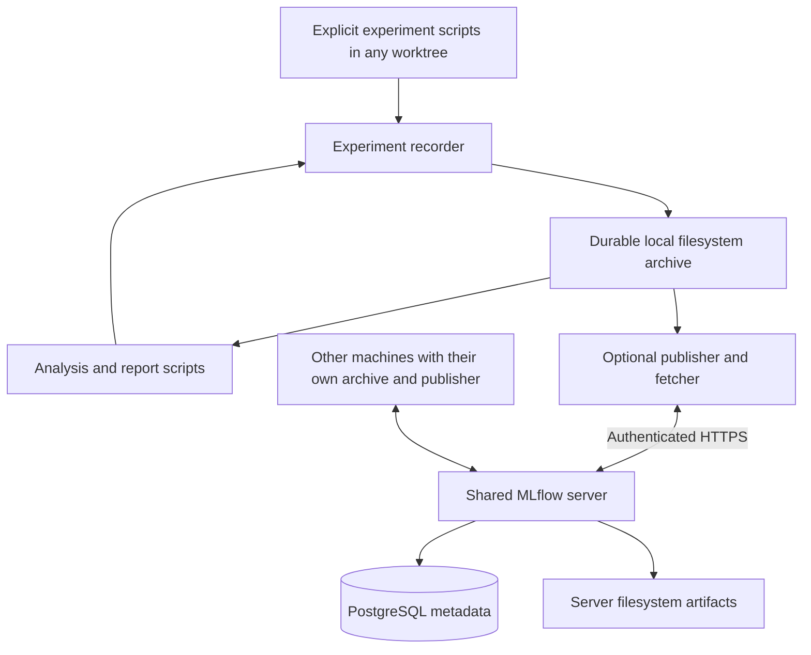

# Experiment storage architecture

**Accepted design, not implemented — 2026-09-25.** Save experiment evidence to durable files outside Git checkouts, then optionally publish those files and searchable metadata to self-hosted MLflow. [Specification §15](specification.md#15-durable-experiment-storage) owns the requirements and acceptance criteria. No recorder, storage setting, publisher, or deployment described here ships yet.

## Current behavior and motivation

The [independent classification report](experiments/2026-09-23-turn-purpose-independent-luna.md#interpretation-and-evidence) documents private inputs, model outputs, comparisons, and logs under the main checkout's ignored `.agentboard/experiments/`. Its published report is versioned; the supporting files are local. Future reports need those exact files and their relationships even after a worktree is removed.

The [development workflow](development.md#automatic-worktree-data-setup) shares a fixed baseline through independent writable dev snapshots. [Settings](../backend/agentboard/config.py), the [CLI](../backend/agentboard/cli.py), and [dependencies](../pyproject.toml) provide no experiment archive or MLflow integration. Database snapshots are recovery evidence, not an experiment catalog. This design adds a separate facility; it does not replace the trace Store or baseline workflow.

## Selected modes and components

| Mode | Required behavior |
| --- | --- |
| `filesystem` (default) | Record, discover, inspect, verify, and read experiments using ordinary local files. No MLflow installation, account, network request, or server is needed. |
| `mlflow` | Perform the same local recording, then attempt publication of finalized runs to the configured private server. Local evidence remains usable during server outages. Fetch selected remote runs into the same archive format. |



The recorder, portable manifest, dependency resolver, and publication journal are AgentBoard integration work. MLflow supplies its tracking API, catalog/UI, and artifact transport. Its [tracking server](https://mlflow.org/docs/latest/self-hosting/architecture/tracking-server/) supports a database backend and proxied artifact access; its [artifact store](https://mlflow.org/docs/latest/self-hosting/architecture/artifact-store/) can use a local filesystem. These upstream capabilities do not supply our preservation or synchronization guarantees automatically.

| Component | Ownership and boundary |
| --- | --- |
| Experiment script | Executes the research or analysis and explicitly calls the recorder. Owns prompts, model execution, transformations, and analysis semantics. |
| Recorder and filesystem reader | Allocate run IDs, preserve bytes, validate/finalize manifests, resolve pinned inputs, and list/read local runs. Keep this interface independent of MLflow. |
| Publisher/fetcher | Use the MLflow SDK only in shared mode; map IDs, project metadata into MLflow, transfer evidence, and report verification/retry outcomes. Never execute experiments. |
| Shared MLflow service | Provide authenticated team search, comparisons, metadata, and artifact transfer. Store files on its own persistent disk and metadata in PostgreSQL. |
| Existing AgentBoard runtime | Continue serving sessions and managing its own SQLite database. Ordinary ingestion, UI activity, classification, and replay do not automatically become experiment runs. |

For example, batched classification and independent classification are two runs in one MLflow experiment group. Individual model calls are retained as artifacts within their run. A comparison/report is another run with both source runs as inputs. These are integration targets; existing scripts/folders are not discovered or uploaded automatically.

## Storage locations and configuration

One machine-level archive is shared by that machine's main checkout and worktrees. Different machines have separate archives and retrieve selected results through MLflow. Local/server copies are deliberate replicas; no result copy is required for each worktree. Local archives are permanent evidence, not automatically evicted caches.

Proposed settings, **not supported by current AgentBoard configuration**:

| Setting | Contract |
| --- | --- |
| `AGENTBOARD_DATA_HOME` | Required absolute archive root for experiment commands, configured once per machine. Resolve symlinks and reject roots inside relevant checkouts or Git metadata. No fallback to the current directory. |
| `AGENTBOARD_EXPERIMENT_MODE` | `filesystem` by default; `mlflow` explicitly enables publication. Reject unknown values. |
| `MLFLOW_TRACKING_URI` | In shared mode, require the designated private HTTPS tracking service; missing/invalid configuration must not silently create a local MLflow store. |

The recorder accepts a stable project namespace and experiment group explicitly; neither is derived from a worktree path or branch name. Credentials use deployment secret configuration, never artifact metadata. Filesystem mode must ignore inherited tracking configuration and avoid importing MLflow. Implementation must define CLI/config precedence and add these settings to the supported interface before publishing runnable examples.

Illustrative layout under the configured root:

```text
<data-home>/
  projects/<project>/
    datasets/<dataset-id>/     # Immutable manifest and complete source files
    runs/<run-id>/
      manifest.json
      inputs/                 # Config, rendered prompts, output schemas
      raw/                    # Original responses, logs, all attempts
      intermediate/
      outputs/                # Results, tables, figures, reports
    staging/                  # Unfinalized runs and incomplete downloads
    sync/                     # Mutable local publication journal and ID mappings
```

Project names and artifact paths must be validated as safe relative names: reject absolute paths, traversal, and escaping symlinks on both write and fetch. Dataset and run IDs are UUIDs independent of Git and MLflow IDs. Reuse a dataset ID only for identical verified content. A filesystem reader scans manifests; any future index is rebuildable and is not the evidence source.

Each worktree still owns `.agentboard/dev.db`; the fixed baseline and checkpoints follow the existing workflow. Do not symlink these databases to the archive or share writable SQLite files across machines. Archive a running database only through a consistent [snapshot](../backend/agentboard/snapshot.py), not a raw copy of its database/WAL files.

## Portable evidence contract

Version 1 uses UTF-8 JSON manifests and preserves original artifact bytes. Raw JSONL, logs, and responses are not rewritten into a normalized format. Derived tables may use JSON/CSV/Parquet, but never replace their raw sources. The immutable dataset manifest contains its ID, format version, source provenance, and the same file inventory below.

| Run manifest field | Meaning and missing-data rule |
| --- | --- |
| `format_version`, `project`, `experiment`, `run_id`, `kind` | Required format/version and identity; `kind` is `experiment` or `report`. Unsupported versions are retained but cannot be interpreted as compatible. |
| `started_at`, `ended_at`, `outcome` | UTC RFC 3339 timestamps following the [timestamp contract](data-lineage.md#61-timestamp-contract). Outcome is `succeeded`, `failed`, `interrupted`, or `unknown`; unavailable historical timestamps remain null with a provenance gap. |
| `code`, `environment`, `configuration` | Commit when known, dirty-state indication, saved script/source snapshot or patch plus required base source, dependency lock, command, parameters, model/provider/version and inference settings when applicable. Retain relevant untracked scripts too. Missing information is a named gap; a commit hash alone is not a preserved executable environment. Do not snapshot unrelated repository files. |
| `inputs` | Exact local or external archived artifact references: project, run/dataset ID, immutable manifest SHA-256, relative artifact path, and file SHA-256. Include all dependencies required by the declared computation; original machine paths are provenance only, never retrieval contracts. |
| `files` | Inventory of every evidence file: relative path, role, media type, byte size, SHA-256, and schema/version for structured results. SHA-256 covers original bytes, not decoded/reformatted JSON. The manifest does not hash itself. |
| `metrics` | Named values with units, origins, and source references/calculation versions. Missing values are null with a reason; omit unavailable metrics from MLflow's numeric projection. Estimated cost must retain its rate-card artifact and currency. |
| `relationships`, `provenance_gaps` | Optional explicit supersedes/comparison relationships and known missing source/code/model evidence. Report inputs use `inputs`; relationships do not substitute for dependency inventories. |

Recording creates new metadata and hashes but loses no supplied artifact bytes. Extracting a metric or normalizing a table creates an additional derived artifact. Use [Normalized, Calculated, Inferred, and Model-generated](data-lineage.md#62-origins-and-timing-quality-are-separate-axes) consistently; recorder metadata is not inferred human authorship. Completeness describes preservation of supplied evidence, not knowledge of unrecorded provider state or proof that a model result is correct.

All supplied attempts and intermediate files are retained, including malformed outputs. Required dependencies must resolve and pass hash verification before a report claims reproducibility; reject cycles and conflicting identities. An environment lock describes dependencies but does not preserve their packages/runtime: offline execution needs those retained or already available in a compatible environment. An archive with historic provenance gaps remains useful evidence but is labeled incomplete for reproduction; inventing missing inputs is prohibited.

## Local lifecycle and report regeneration

1. Allocate a new run ID and exclusive staging directory before execution. Write each completed artifact through a temporary file, flush it, and atomically publish it within that directory. Preserve partial files separately after failure; they are not complete outputs.
2. On normal completion or handled failure, inventory the evidence, record the actual outcome, verify inputs and hashes, and write the final manifest. Flush files/directories and atomically rename into `runs/<run-id>/` on the same filesystem. Durability depends on storage honoring synchronization. Never acknowledge finalization after a failed write.
3. Finalized runs are immutable through the recorder, irrespective of success/failure. Corrections and reruns receive new IDs. Interrupted staging is visible as unfinished evidence; explicit recovery may seal it as interrupted without inventing an execution end time. Validation failures keep it in staging.
4. Report scripts resolve exact run/dataset versions through the reader and save outputs as a new report run. They do not select a moving `latest` reference. A changed report script, schema, or aggregation rule produces new output provenance.

**Synthetic example:** classification runs A and B refer to dataset D. Report C pins A's and B's result files and D's sample identities, joins by those identities and input hashes, then calculates a disagreement table. It records the join key, unmatched/duplicate policy, rubric versions, denominator, and analysis code. It fails on incompatible schemas unless an explicit saved conversion is supplied. Missing or duplicate samples cannot silently become agreement or disappear from the denominator.

Regenerating C uses saved responses and makes no model call. The declared deterministic analysis must reproduce its substantive tables from preserved inputs/environment; timestamps or packaging bytes may differ and must be identified. A fresh model execution is a new experiment and is not guaranteed to reproduce old answers. Reading a downloaded archive must never automatically execute its saved scripts or deserialize executable objects.

## MLflow mapping and publication

| Portable evidence | MLflow projection |
| --- | --- |
| Project + experiment group | Experiment name, namespaced by project. |
| Stable AgentBoard run ID and manifest SHA-256 | Run tags `agentboard.run_id`, `agentboard.project`, and `agentboard.manifest_sha256`; local journal maps the endpoint and portable ID to the MLflow run ID. |
| Scalar configuration and numeric metrics | Selected parameters/metrics with their full typed values, units, and derivation retained in the manifest. Projection limits must not truncate the evidence archive. |
| Run bundle and required source dependencies | Artifacts containing the portable bundle and complete dependency closure, including manifests. A local pathname or MLflow dataset metadata entry alone is insufficient. |
| Execution and publication state | MLflow execution status plus separate `agentboard.publication_state` tag. A successful model execution does not mean its artifacts are fully uploaded. |

Publish finalized runs after local success or failure has been recorded. No live event streaming or background scheduler is required in version 1: attempt publication on finalization, and expose explicit retry/status operations. Failed publication must return a visible error/pending result without deleting or changing local evidence.

The local journal records `pending`, `uploading`, `verified`, `failed`, or `conflict`, independently of the experiment outcome. Persist the remote run mapping before artifact upload. Serialize publishers for a given endpoint/project/run using a local lock. Retry known mappings; check the stable-ID tags after an ambiguous create response. Zero or multiple candidates after an uncertain creation require reconciliation, not an unverified second create. MLflow tags are not a uniqueness constraint, and its [client API](https://mlflow.org/docs/latest/api_reference/python_api/mlflow.client.html) is not an exactly-once transaction with local files. Concurrent publication of the same portable run from different machines is unsupported in version 1 and must surface conflicts.

Upload evidence and dependencies first. Retrieve and hash the remote bytes, then write a completion artifact containing the manifest hash last and mark publication verified. Consumers require that marker and validate the manifest, inventory, and dependency closure; MLflow's finished status alone is insufficient. An interrupted upload stays incomplete. Fetch into staging and atomically admit verified bundles, reusing identical existing artifacts and rejecting conflicting content under the same ID. Preserve any prior local archive.

Version 1 may duplicate shared dataset bytes between remote run bundles to make each publication complete. Local dependency references avoid per-worktree copies. Cross-run remote deduplication is deferred; it must not turn manifests into dangling references. The portable manifest and bytes are authoritative if MLflow's mutable display metadata disagrees. Recorder immutability is an application rule, not protection from server administrators changing files.

## Shared deployment, privacy, and recovery

Deploy one private MLflow service with PostgreSQL metadata and a persistent server artifact directory outside any checkout/container writable layer. Use MLflow artifact proxying so clients access both metadata and files through the service; never advertise the server's local `file://` paths as client-accessible storage. Clients do not connect directly to PostgreSQL. This database is separate from AgentBoard's trace database.

Provide HTTPS, authenticated team access, restricted host configuration, and privately managed credentials. MLflow offers [authentication and experiment permissions](https://mlflow.org/docs/latest/self-hosting/security/basic-http-auth/); deployment must verify access with synthetic data. Pin/test MLflow and database versions when implementing the deployment. S3, distributed storage, Kubernetes, and a job queue are unnecessary for this design.

The [current local-only policy](development.md#automatic-worktree-data-setup) remains in force. Implementing shared mode requires a documented, scoped policy for owner-designated experiment bundles and their dependencies going to the designated private service; it must not become a blanket upload of Codex homes, live telemetry databases, or unrelated worktrees. Configure the approved destination explicitly. Recorder-generated metadata excludes credentials; supplied raw evidence is preserved rather than silently redacted. A bundle that cannot be shared stays local and reports the restriction. This design PR moves or publishes no real evidence.

Back up both local archives and the service's metadata/artifacts, including authentication configuration needed for restoration. Keep backups on separate storage; local/server replicas are not independent historical backups. Define a coordinated database/artifact backup point or quiesce publication during backup, then verify completion markers and hashes after restoration. Test restoration to an isolated destination, including downloading a run and resolving report inputs. Agree the backup schedule, retention, and recovery window before real-data rollout. Version 1 performs no automatic archive deletion or garbage collection; retain all report dependencies.

## Migration and implementation sequence

1. **Portable filesystem format:** implement the recorder/reader, machine-level root, validation, interrupted-run recovery, and offline report example. Keep MLflow optional and tracing startup unchanged.
2. **Legacy import:** inventory explicitly selected experiment directories, all files, and their referenced source archives. Produce a dry-run hash/provenance report; copy into new bundles and verify every byte without removing originals. Record missing historic configuration as unknown. Journal each source inventory so identical repeat imports reuse the mapping; changed sources require a new run. Do not run models to fill gaps.
3. **Shared service and adapter:** implement the private deployment, scoped data policy, publication journal, dependency transfer, and fetch verification. Establish behavior against pinned MLflow versions using synthetic runs before publishing selected real evidence.
4. **Producer adoption and recovery:** instrument experiment/report scripts, migrate references only after verified imports, and exercise backup/restore and cross-machine reads. Existing report documents remain evidence of their original execution; migration records add storage provenance without rewriting history.

These steps do not refresh, relocate, or migrate the development baseline/dev databases. Remaining implementation decisions include the exact Python/CLI interface, machine configuration mechanism, service host/version pins, operator credential setup, and backup schedule. They do not change the selected two modes, portable evidence contract, or filesystem-backed MLflow architecture.

## Verification status

This document is based on source review and the linked upstream documentation, not an executed prototype. No application behavior, dependency, configuration, schema, service, or data location changes with this design. [EXP-01–12](specification.md#15-durable-experiment-storage) enumerate the required implementation checks; follow the [testing guide](testing.md) when implementing them. Review documentation links/examples and run `git diff --check` for this documentation-only change.
