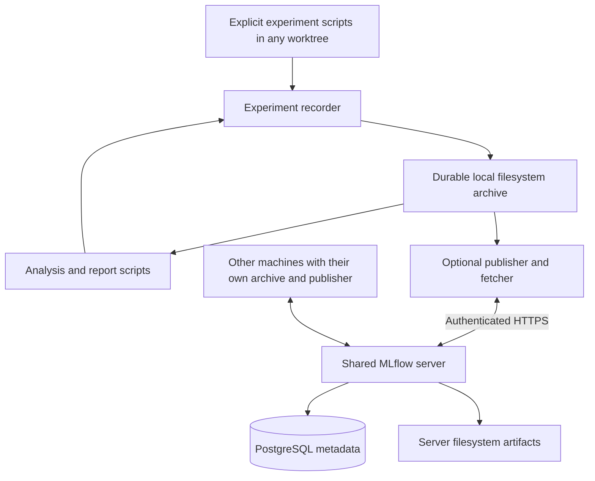

# Experiment storage architecture

**Filesystem implemented — 2026-09-25.** The recorder, reader and offline coverage report use durable files outside Git checkouts. Optional MLflow publication/deployment and Hugging Face dataset storage remain planned. [Specification §15](specification.md#15-durable-experiment-storage) owns the requirements and acceptance criteria.

The [dataset curation module](dataset-curation.md) consumes pinned results for label review and input-only duplicate suggestions. Mutable review workspaces live in `sync/curation/`; each export is a new immutable dataset bundle. Historical classifier runs and raw evidence remain unchanged.

## Boundaries

Experiment inputs, attempts, results, analysis code and reports live in immutable bundles under the machine data home. The completed one-time migration copied selected historical evidence there without changing originals. Consumers resolve pinned manifest/artifact hashes, so worktree removal cannot invalidate an archived dependency. Git documentation describes formats and workflows; it is not a second experiment catalog.

The [development workflow](development.md#automatic-worktree-data-setup) shares a fixed baseline through independent writable dev snapshots. The [experiment CLI](../backend/agentboard/experiments/cli.py) has separate machine settings and dispatches before the trace Runtime. The standard-library [recorder](../backend/agentboard/experiments/archive.py) adds no MLflow dependency. Database snapshots are recovery evidence, not an experiment catalog. This facility does not replace the trace Store or baseline workflow.

## Selected modes and components

| Mode | Required behavior |
| --- | --- |
| `filesystem` (default) | Record, discover, inspect, verify, and read experiments using ordinary local files. No MLflow installation, account, network request, or server is needed. |
| `mlflow` (planned; rejected by the current CLI) | Perform the same local recording, then attempt publication of finalized runs to the configured private server. Local evidence remains usable during server outages. Fetch selected remote runs into the same archive format. |



The recorder, portable manifest and dependency resolver are implemented AgentBoard components. Publication/fetching and their journal remain integration work. MLflow supplies its tracking API, catalog/UI, and artifact transport. Its [tracking server](https://mlflow.org/docs/latest/self-hosting/architecture/tracking-server/) supports a database backend and proxied artifact access; its [artifact store](https://mlflow.org/docs/latest/self-hosting/architecture/artifact-store/) can use a local filesystem. These upstream capabilities do not supply our preservation or synchronization guarantees automatically.

| Component | Ownership and boundary |
| --- | --- |
| Experiment script | Executes the research or analysis and explicitly calls the recorder. Owns prompts, model execution, transformations, and analysis semantics. |
| Recorder and filesystem reader | Allocate run IDs, preserve bytes, validate/finalize manifests, resolve pinned inputs, and list/read local runs. Keep this interface independent of MLflow. |
| Publisher/fetcher | Use the MLflow SDK only in shared mode; map IDs, project metadata into MLflow, transfer evidence, and report verification/retry outcomes. Never execute experiments. |
| Shared MLflow service | Provide authenticated team search, comparisons, metadata, and artifact transfer. Store files on its own persistent disk and metadata in PostgreSQL. |
| Existing AgentBoard runtime | Continue serving sessions and managing its own SQLite database. Ordinary ingestion, UI activity, classification, and replay do not automatically become experiment runs. |

For example, batched classification and independent classification are two runs in one MLflow experiment group. Individual model calls are retained as artifacts within their run. A comparison/report is another run with both source runs as inputs. Filesystem runs support this relationship now; MLflow mapping remains a target. Existing scripts/folders are not discovered or uploaded automatically.

## Storage locations and configuration

One machine-level archive is shared by that machine's main checkout and worktrees. Different machines can use separate archives; MLflow retrieval is planned. Local bundles can already be copied and verified at another data home. Local/server copies are deliberate replicas; no result copy is required for each worktree. Local archives are permanent evidence, not automatically evicted caches.

Experiment settings are separate from trace TOML/SQLite configuration. Precedence is **CLI flags > machine TOML > environment**. The machine file defaults to `~/.agentboard/config.toml`; `--archive-config` selects another file. A data home is required, with no working-directory fallback:

| Setting | Contract |
| --- | --- |
| `AGENTBOARD_DATA_HOME` | Required absolute machine data root; experiment evidence lives under its `experiments/` child. The selected location on the current machine is `/Users/coral/.agentboard/data`. Resolve symlinks and reject data/archive roots inside relevant checkouts or Git metadata. No fallback to the current directory. |
| `AGENTBOARD_EXPERIMENT_MODE` | `filesystem` by default. Unknown values and the unimplemented `mlflow` mode fail explicitly. |
| `MLFLOW_TRACKING_URI` (future) | Ignored by filesystem mode. In future shared mode, require the designated private HTTPS tracking service; missing/invalid configuration must not silently create a local MLflow store. |

The recorder accepts a stable project namespace and experiment group explicitly as metadata; neither is derived from a worktree path or branch name, and neither adds a directory level. Credentials use deployment secret configuration, never artifact metadata. Filesystem mode ignores inherited tracking configuration and never imports MLflow. The supported machine TOML is:

```toml
[experiments]
data_home = "/Users/coral/.agentboard/data"
mode = "filesystem"
```

Trace `--config` and `--database` flags are rejected for experiment commands; use `experiments --archive-config` instead.

Implemented layout under the configured root:

```text
<data-home>/
  experiments/
    datasets/<dataset-id>/     # Immutable manifest and complete source files
    runs/<run-id>/
      manifest.json
      inputs/                 # Config, rendered prompts, output schemas
      raw/                    # Original responses, logs, all attempts
      intermediate/
      outputs/                # Results, tables, figures, reports
    staging/                  # Unfinalized runs and incomplete downloads
    sync/                     # Mutable navigation and review state
      curation/               # Review workspaces; separate from immutable bundles
```

There is no `projects/<project>/` directory. Validate project namespace metadata and safe relative artifact paths; reject absolute artifact paths, traversal, and escaping symlinks on both write and fetch. Dataset and run IDs are UUIDs independent of Git and MLflow IDs. New recorder calls allocate new IDs. Existing verified bundles retain their IDs when copied to another data home. A filesystem reader scans manifests; any future index is rebuildable and is not the evidence source. Lifecycle paths such as `runs/`, `staging/`, and `sync/` below are relative to `<data-home>/experiments/`.

Each worktree still owns `.agentboard/dev.db`; the fixed baseline and checkpoints follow the existing workflow. Do not symlink these databases to the archive or share writable SQLite files across machines. Archive a running database only through `Recorder.add_sqlite_snapshot()` (SQLite backup plus integrity check) or the existing [snapshot command](../backend/agentboard/snapshot.py).

## Filesystem commands and producer API

```sh
uv run agentboard experiments list
uv run agentboard experiments inspect RUN_ID
uv run agentboard experiments verify RUN_ID
uv run agentboard experiments read RUN_ID outputs/results.json > /tmp/results.json
uv run agentboard experiments coverage /absolute/path/coverage-recipe.json
uv run agentboard experiments recover UNFINISHED_ID
uv run python examples/experiment_storage.py
```

`list` discovers manifests and unfinished staging without hashing every artifact; `verify` checks every file and the transitive pinned input closure. `inspect` reads metadata; `read` verifies before streaming bytes. None executes saved code. The [synthetic example](../examples/experiment_storage.py) explicitly records a dataset and saved result, calculates coverage, copies/restores the archive and regenerates identical report bytes with the saved standalone analysis. It uses temporary directories and makes no model call.

Python producers explicitly create `Archive(absolute_data_home)`, call `begin(project, experiment, kind=..., metadata=..., inputs=...)`, add original files with `add_file()` or derived JSON with `add_json()`, then `finalize(outcome="succeeded")` or `finalize(outcome="failed")`. Retain prompts, attempts, outputs, relevant code and environment evidence explicitly. The recorder never infers them from a working directory. Obtain pinned references with `archive.reference(id, path)` and resolve them through `archive.resolve(reference)`.

The one-time legacy migration is complete. Its importer, `experiments import` command and working migration scripts have been removed; legacy migration compatibility is not maintained. New producers use the recorder API directly. The [migration audit](#local-migration-audit) and immutable archived evidence remain available.

Interrupted staging is visible. Explicit `recover` seals preserved evidence as `interrupted`, with no invented end time; partial files are retained as incomplete evidence. A recovery filename collision fails before overwriting either artifact. This implementation uses POSIX filesystem locks and requires a local filesystem supporting atomic rename and fsync; network filesystems and Windows are not verified.

Coverage recipes use `format_version: "classification-coverage-v1"`, `project`, `experiment`, a pinned `dataset` reference to the turn array, and `results` entries containing a pinned `reference` and `format` (`turn-comparison-v1` or `independent-turn-v1`). These adapters interpret the retained historical result layouts; they are not general schema inference. Each model/reasoning-effort/execution-mode combination is separate. Overlapping configurations or duplicate targets fail for explicit reconciliation. Missing targets or absent/null per-model comparison results, changed complete input hashes, unsupported categories, absent reasons and recorded prompt-compliance errors remain pending. Extra historical targets are reported outside the requested subset. No entries disappear from the denominator.

A coverage run saves the recipe, materialized pinned inputs, standalone standard-library analysis source and deterministic output. It pins the complete source manifests, preserving prompts and provenance alongside the analysis. The output distinguishes batched and independent execution; it does not establish model equivalence, validate provider internals, or waive historical semantic errors. Unsupported schemas/providers fail without executing archive contents.

## Dataset and classification coverage

**Verified from the pinned local coverage report on 2026-10-04.** The selected combined dataset contains **311 user sessions and 1,915 turn targets** from local and Spark sources. The latest import cutoff is `2026-10-04T00:00:00+01:00`, exclusive (Europe/London); complete files spanning it were excluded. The earlier 1,431 inputs and labels are preserved, and all eight configurations classified 484 added turns. See the [incremental execution record](turn-classifier-run.md#incremental-inference-through-3-october-2026) for selection, frozen encoder results and evaluation limits.

| Model | Reasoning effort | Execution | Available / requested | Pending |
| --- | --- | --- | ---: | ---: |
| GPT-6 Astra | xhigh | independent | 1,915 / 1,915 | 0 |
| GPT-6 Sol | xhigh | independent | 1,915 / 1,915 | 0 |
| GPT-6 Luna | low | independent | 1,915 / 1,915 | 0 |
| GPT-6 Luna | max | independent | 1,915 / 1,915 | 0 |
| GPT-5.6 Sol | xhigh | independent | 1,915 / 1,915 | 0 |
| GPT-5.6 Terra | low | independent | 1,915 / 1,915 | 0 |
| GPT-5.6 Luna | low | independent | 1,915 / 1,915 | 0 |
| GPT-5.6 Luna | max | independent | 1,915 / 1,915 | 0 |

All eight configurations use `session-purpose-v1`. Coverage archive `3429c4e0-c111-4ed1-a557-6d8b851787fd` pins the expanded dataset and consolidated results, with zero pending targets. Low and max reasoning remain separate configurations. This establishes usable saved results under the coverage checks, not human verification or classification accuracy. Older batched/subset runs remain historical evidence with their original coverage; batched results were retired from active coverage/comparison only after the independent replacement passed verification.

The user selected **GPT-6 Astra xhigh, independent**, as the starting reference answers on September 26, superseding GPT-6 Sol. Its saved categories and reasons are pinned to source results and complete input hashes; human review has not been performed. All seven other configurations are compared only with Astra over the selected denominator, including the incremental comparison. Curation must explicitly select its inferred reference; human adjudication remains a separate step.

Consolidation matches session/turn identity and full input hash. It rebases `index`, `session_index`, `turn_number` and `previous_turn_index` to the expanded cohort while preserving categories, reasons and input hashes. Each row retains `source_result_index` and a pinned `source_reference` to the original record; original archived bytes remain unchanged.

Coverage is calculated per pinned report by session/turn identity, full classifier-input hash (including predecessor context), model, effort, execution and taxonomy. Missing, invalid or changed-input results stay pending; incompatible configurations never fill one another's gaps. Each report retains its denominator and excluded targets. A later dataset or classifier execution creates new immutable artifacts; neither old results nor historical execution outcomes are rewritten.

`sync/current-classification.json` is rebuildable machine-local navigation to pinned artifacts, not an authoritative result or a document to commit. `curate --current` resolves its coverage recipe and saves exact references. Future reports may select different results; use archived manifests and the [filesystem commands](#filesystem-commands-and-producer-api) to inspect them.

### Reference agreement and estimated API cost

**Dated aggregate observations, 2026-09-26.** Agreement means category matches with Astra's model-generated answers, not accuracy against human ground truth. Every row covers 1,431 successful independent classifications; the reference cost is shown separately and is not added to each comparator.

| Independent configuration | Matches with Astra | Agreement | Estimated API cost, USD | Estimated USD per turn |
| --- | ---: | ---: | ---: | ---: |
| GPT-6 Astra extra-high | Reference | — | $237.73 | $0.16613 |
| GPT-6 Sol extra-high | 1,295 | 90.50% | $45.99 | $0.03214 |
| GPT-5.6 Luna max | 1,243 | 86.86% | $4.24 | $0.00296 |
| GPT-6 Luna max | 1,235 | 86.30% | $2.31 | $0.00161 |
| GPT-5.6 Sol extra-high | 1,227 | 85.74% | $87.87 | $0.06141 |
| GPT-5.6 Terra low | 1,138 | 79.52% | $44.10 | $0.03082 |
| GPT-5.6 Luna low | 1,101 | 76.94% | $3.95 | $0.00276 |
| GPT-6 Luna low | 1,091 | 76.24% | $2.17 | $0.00152 |

Relative to the saved low-effort results, GPT-6 Luna max gained 10.06 percentage points of agreement for an estimated additional $0.14; GPT-5.6 Luna max gained 9.92 points for $0.29. These observations apply to this dataset and reference, not a general model ranking.

Prices use the [Standard, short-context API rate card](https://developers.openai.com/api/docs/pricing) saved on **2026-09-26**. They are hypothetical estimates from the recorded OAuth usage, not observed OAuth charges. A real API rerun may consume different tokens or cache writes. Refresh the dated rates before presenting a later pricing comparison.

| Model | Input USD / 1M tokens | Cached input USD / 1M tokens | Output USD / 1M tokens |
| --- | ---: | ---: | ---: |
| GPT-6 Astra | $10.00 | $1.00 | $50.00 |
| GPT-6 Sol | $2.00 | $0.20 | $10.00 |
| GPT-5.6 Sol | $4.00 | $0.40 | $20.00 |
| GPT-5.6 Terra | $2.00 | $0.20 | $12.00 |
| GPT-5.6 Luna | $0.20 | $0.02 | $1.20 |
| GPT-6 Luna | $0.10 | $0.01 | $0.50 |

The calculation is `((input - cached_input) × input_rate + cached_input × cached_rate + output × output_rate) / 1,000,000`. Input includes cached input; output includes reasoning, so neither subset is added again. The saved rate card uses GPT-5.6 Sol's promotional rate. All 11,448 successful results have usage; the largest input is 63,242 tokens, below the saved 272K long-context threshold. Cache writes were zero. The estimates exclude unknown failed-attempt usage, additional reruns, taxes, regional uplifts and other service tiers.

### Recorded usage and input cache

Counts cover the same 1,431 successful classifications per configuration, including the 659 reused GPT-6 Luna low results. Total tokens are input plus output; cache writes are zero for every configuration.

| Independent configuration | Input tokens | Cached input subset | Cached share | Calls with cache hits | Output tokens |
| --- | ---: | ---: | ---: | ---: | ---: |
| GPT-6 Astra extra-high | 22,696,932 | 0 | 0% | 0 | 215,126 |
| GPT-6 Sol extra-high | 22,025,373 | 0 | 0% | 0 | 193,878 |
| GPT-5.6 Luna max | 19,236,249 | 0 | 0% | 0 | 326,423 |
| GPT-6 Luna max | 21,771,784 | 28,160 | 0.129% | 2 | 264,146 |
| GPT-5.6 Sol extra-high | 21,426,027 | 0 | 0% | 0 | 108,448 |
| GPT-5.6 Terra low | 21,423,304 | 0 | 0% | 0 | 104,848 |
| GPT-5.6 Luna low | 19,248,473 | 30,464 | 0.158% | 1 | 90,989 |
| GPT-6 Luna low | 21,375,207 | 50,432 | 0.236% | 3 | 70,613 |

### Execution evidence and limits

Each call used the same eight-category rubric, one target per fresh ephemeral Codex process and immediately preceding turn context, with no saved labels or later turns. Input hashes match the pinned dataset. The user explicitly authorized these dataset experiments through ChatGPT OAuth; application integration tests retain their [isolated private-endpoint policy](testing.md#private-model-tests). New calls used CLI 0.157.0, read-only sandbox and ignored user configuration/rules; the 659 reused GPT-6 Luna low results used CLI 0.155.1. Provider revision and sampling state are unknown, so identical inputs do not establish identical runtime conditions.

The 772 pending GPT-6 Luna low targets completed without retries. The original four remaining models produced 5,724 valid results in 5,746 process attempts: 20 authentication interruptions and two capacity failures were retried successfully; all 22 failed attempts lack usage. A narrowly scoped validator correction revalidated 474 completed HTTPS-recovered calls without new model calls, retaining original verdicts and logs. Astra and each Luna max configuration subsequently completed 1,431 targets in 1,431 attempts each. All available results passed recorded structural/compliance checks, with no model tool calls; these checks do not establish semantic accuracy.

The September 26 immutable evidence is indexed by the following bundles; full inputs, outputs, attempts, scripts, rate-card snapshot and pinned dependencies remain private under the configured data home:

| Evidence | Bundle ID |
| --- | --- |
| Eight-configuration comparison, API estimates and cache | `d558c078-de57-4c90-b4fa-6cba4453470c` |
| Eight-configuration coverage | `3ac2cb59-a635-4fea-bdb2-08fb1ceef143` |
| Unchanged Astra starting reference answers | `bfeca1b2-46a8-4fb7-b909-09463d776fe6` |
| Batched-retirement receipt | `47a42f42-c244-4c81-9ca5-ed96559aa2f7` |

The completed experiments verified identities, full input/schema hashes, original outputs/logs, requested model/effort and usage. Synthetic checks rejected missing, duplicate, stale, batched and incompatible results; pricing checks covered cached discounts, reasoning counted once and invalid usage. Direct source recounts matched all seven agreement totals. Archive/dependency verification and byte-identical offline regeneration passed before navigation changed. Adding the two max configurations preserved all six prior result sets, five prior agreement/kappa pairs, six prior API estimates and Astra's reference answers. Earlier reports and original attempts remain immutable. These are experiment checks; no application/backend/frontend, browser, private-endpoint or app-server schema checks were run for this documentation-only update.

## Future dataset storage

**Deferred direction:** move dataset version storage to Hugging Face while keeping experiment results in this archive. Initially, datasets use `experiments/datasets/`. Keep logical dataset identity, immutable content/version references, subset selection, and hashes separate from their storage location, so a later adapter can resolve the same evidence elsewhere.

The future adapter must pin a dataset repository and immutable revision, plus manifest/artifact hashes; a local pathname or moving branch name is insufficient. Preserve verified local evidence needed for offline report regeneration. This is a dataset-storage extension, not a third experiment publication mode or a required dependency for filesystem recording. Repository/access policy, revision mapping, and migration verification belong to [WL-004](backlog.md#wl-004--hugging-face-dataset-version-storage). No Hugging Face adapter or dataset upload is part of the initial implementation.

## Portable evidence contract

Version 1 uses UTF-8 JSON manifests and preserves original artifact bytes. Raw JSONL, logs, and responses are not rewritten into a normalized format. Derived tables may use JSON/CSV/Parquet, but never replace their raw sources. The immutable dataset manifest contains its ID, format version, source provenance, and the same file inventory below.

| Run manifest field | Meaning and missing-data rule |
| --- | --- |
| `format_version`, `project`, `experiment`, `run_id`, `kind` | Required format/version and identity; `kind` is `experiment` or `report`. Unsupported versions are retained but cannot be interpreted as compatible. |
| `started_at`, `ended_at`, `outcome` | UTC RFC 3339 timestamps following the [timestamp contract](data-lineage.md#61-timestamp-contract). Outcome is `succeeded`, `failed`, `interrupted`, or `unknown`; unavailable historical timestamps remain null with a provenance gap. |
| `code`, `environment`, `configuration` | Commit when known, dirty-state indication, saved script/source snapshot or patch plus required base source, dependency lock, command, parameters, model/provider/version and inference settings when applicable. Retain relevant untracked scripts too. Missing information is a named gap; a commit hash alone is not a preserved executable environment. Do not snapshot unrelated repository files. |
| `inputs` | Exact local or external archived artifact references: project, run/dataset ID, immutable manifest SHA-256, relative artifact path, and file SHA-256. Include all dependencies required by the declared computation; original machine paths are provenance only, never retrieval contracts. |
| `coverage` (classification runs/reports) | Pin the dataset and requested target-subset artifact, model/inference configuration, and session/turn identities with full classifier input hashes. Reference available results and pending targets with reasons. Preserve the historical execution subset; current-dataset coverage is a separate derived report, independent of execution and publication outcomes. |
| `files` | Inventory of every evidence file: relative path, role, media type, byte size, SHA-256, and schema/version for structured results. SHA-256 covers original bytes, not decoded/reformatted JSON. The manifest does not hash itself. |
| `metrics` | Named values with units, origins, and source references/calculation versions. Missing values are null with a reason; omit unavailable metrics from MLflow's numeric projection. Estimated cost must retain its rate-card artifact and currency. |
| `relationships`, `provenance_gaps` | Optional explicit supersedes/comparison relationships and known missing source/code/model evidence. Report inputs use `inputs`; relationships do not substitute for dependency inventories. |

Recording creates new metadata and hashes but loses no supplied artifact bytes. Extracting a metric or normalizing a table creates an additional derived artifact. Use [Normalized, Calculated, Inferred, and Model-generated](data-lineage.md#62-origins-and-timing-quality-are-separate-axes) consistently; recorder metadata is not inferred human authorship. Completeness describes preservation of supplied evidence, not knowledge of unrecorded provider state or proof that a model result is correct.

All supplied attempts and intermediate files are retained, including malformed outputs. Required dependencies must resolve and pass hash verification before a report claims reproducibility; reject cycles and conflicting identities. An environment lock describes dependencies but does not preserve their packages/runtime: offline execution needs those retained or already available in a compatible environment. An archive with historic provenance gaps remains useful evidence but is labeled incomplete for reproduction; inventing missing inputs is prohibited.

## Local lifecycle and report regeneration

1. Allocate a new run ID and exclusive staging directory before execution. Write each completed artifact through a temporary file, flush it, and atomically publish it within that directory. Preserve partial files separately after failure; they are not complete outputs.
2. On normal completion or handled failure, inventory the evidence, record the actual outcome, verify inputs and hashes, and write the final manifest. Flush files/directories and atomically rename into `runs/<run-id>/` on the same filesystem. Durability depends on storage honoring synchronization. Never acknowledge finalization after a failed write.
3. Finalized runs are immutable through the recorder, irrespective of success/failure. Corrections and reruns receive new IDs. Interrupted staging is visible as unfinished evidence; explicit recovery may seal it as interrupted without inventing an execution end time. Validation failures keep it in staging.
4. Report scripts resolve exact run/dataset versions through the reader and save outputs as a new report run. They do not select a moving `latest` reference. A changed report script, schema, or aggregation rule produces new output provenance.

**Synthetic example:** classification runs A and B refer to dataset D. Report C pins A's and B's result files and D's sample identities, joins by those identities and input hashes, then calculates a disagreement table. It records the join key, unmatched/duplicate policy, rubric versions, denominator, and analysis code. It fails on incompatible schemas unless an explicit saved conversion is supplied. Missing or duplicate samples cannot silently become agreement or disappear from the denominator.

Regenerating C uses saved responses and makes no model call. The declared deterministic analysis must reproduce its substantive tables from preserved inputs/environment; timestamps or packaging bytes may differ and must be identified. A fresh model execution is a new experiment and is not guaranteed to reproduce old answers. Reading a downloaded archive must never automatically execute its saved scripts or deserialize executable objects.

## MLflow mapping and publication

**Planned; no publisher, fetcher or service is implemented.**

| Portable evidence | MLflow projection |
| --- | --- |
| Project + experiment group | Experiment name, namespaced by project. |
| Stable AgentBoard run ID and manifest SHA-256 | Run tags `agentboard.run_id`, `agentboard.project`, and `agentboard.manifest_sha256`; local journal maps the endpoint and portable ID to the MLflow run ID. |
| Scalar configuration and numeric metrics | Selected parameters/metrics with their full typed values, units, and derivation retained in the manifest. Projection limits must not truncate the evidence archive. |
| Run bundle and required source dependencies | Artifacts containing the portable bundle and complete dependency closure, including manifests. A local pathname or MLflow dataset metadata entry alone is insufficient. |
| Execution and publication state | MLflow execution status plus separate `agentboard.publication_state` tag. A successful model execution does not mean its artifacts are fully uploaded. |

Publish finalized runs after local success or failure has been recorded. No live event streaming or background scheduler is required in version 1: attempt publication on finalization, and expose explicit retry/status operations. Failed publication must return a visible error/pending result without deleting or changing local evidence.

The local journal records `pending`, `uploading`, `verified`, `failed`, or `conflict`, independently of the experiment outcome. Persist the remote run mapping before artifact upload. Serialize publishers for a given endpoint/project/run using a local lock. Retry known mappings; check the stable-ID tags after an ambiguous create response. Zero or multiple candidates after an uncertain creation require reconciliation, not an unverified second create. MLflow tags are not a uniqueness constraint, and its [client API](https://mlflow.org/docs/latest/api_reference/python_api/mlflow.client.html) is not an exactly-once transaction with local files. Concurrent publication of the same portable run from different machines is unsupported in version 1 and must surface conflicts.

Upload evidence and dependencies first. Retrieve and hash the remote bytes, then write a completion artifact containing the manifest hash last and mark publication verified. Consumers require that marker and validate the manifest, inventory, and dependency closure; MLflow's finished status alone is insufficient. An interrupted upload stays incomplete. Fetch into staging and atomically admit verified bundles, reusing identical existing artifacts and rejecting conflicting content under the same ID. Preserve any prior local archive.

Version 1 may duplicate shared dataset bytes between remote run bundles to make each publication complete. Local dependency references avoid per-worktree copies. Cross-run remote deduplication is deferred; it must not turn manifests into dangling references. The portable manifest and bytes are authoritative if MLflow's mutable display metadata disagrees. Recorder immutability is an application rule, not protection from server administrators changing files.

## Shared deployment, privacy, and recovery

Deploy one private MLflow service with PostgreSQL metadata and a persistent server artifact directory outside any checkout/container writable layer. Use MLflow artifact proxying so clients access both metadata and files through the service; never advertise the server's local `file://` paths as client-accessible storage. Clients do not connect directly to PostgreSQL. This database is separate from AgentBoard's trace database.

Provide HTTPS, authenticated team access, restricted host configuration, and privately managed credentials. MLflow offers [authentication and experiment permissions](https://mlflow.org/docs/latest/self-hosting/security/basic-http-auth/); deployment must verify access with synthetic data. Pin/test MLflow and database versions when implementing the deployment. S3, distributed storage, Kubernetes, and a job queue are unnecessary for this design.

The [current local-only policy](development.md#automatic-worktree-data-setup) remains in force. Implementing shared mode requires a documented, scoped policy for owner-designated experiment bundles and their dependencies going to the designated private service; it must not become a blanket upload of Codex homes, live telemetry databases, or unrelated worktrees. Configure the approved destination explicitly. Recorder-generated metadata excludes credentials; supplied raw evidence is preserved rather than silently redacted. A bundle that cannot be shared stays local and reports the restriction. The filesystem migration is local only and publishes no evidence.

Back up both local archives and the service's metadata/artifacts, including authentication configuration needed for restoration. Keep backups on separate storage; local/server replicas are not independent historical backups. Define a coordinated database/artifact backup point or quiesce publication during backup, then verify completion markers and hashes after restoration. Test restoration to an isolated destination, including downloading a run and resolving report inputs. Agree the shared service backup schedule, retention, and recovery window before its real-data rollout. Automated local backups and a tested operational recovery schedule are not implemented; the synthetic example verifies local copy/restore semantics only. Version 1 performs no automatic archive deletion or garbage collection; retain all report dependencies.

## Migration and implementation sequence

1. **Portable filesystem format (implemented):** provide the recorder/reader under `<data-home>/experiments/`, validation, interrupted-run recovery, and offline report example. Keep project identity in metadata, dataset references independent of their storage location, MLflow optional, and tracing startup unchanged.
2. **One-time legacy migration (completed):** the selected directories, full source dependencies and one combined dataset were inventoried, copied and verified. Historical subsets, raw files, unknown provenance and pending coverage were preserved. The migration tooling was then removed at the user's request; no legacy import interface is maintained. New reports and experiments use the recorder directly.
3. **Shared service and adapter:** implement the private deployment, scoped data policy, publication journal, dependency transfer, and fetch verification. Establish behavior against pinned MLflow versions using synthetic runs before publishing selected real evidence.
4. **Producer adoption and recovery:** instrument experiment/report scripts, migrate references only after verified imports, and exercise backup/restore and cross-machine reads. Archived reports retain their original execution evidence; migration records add storage provenance without rewriting history. Any later classifier execution records a new run over an explicit target subset; it is separate from storage migration.

These steps do not refresh, relocate, or migrate the development baseline/dev databases. Remaining decisions concern the future service host/version pins, operator credential setup and operational backup schedule. They do not change the selected two modes, portable evidence contract, or filesystem-backed MLflow architecture.

## Local migration audit

**Completed 2026-09-25.** The migration produced one combined source dataset (247 user sessions, 1,431 targets, 346 complete raw rollout files), eight preserved historical experiment/import bundles, a coverage report and a migration verification report. The initial copy inventory contained **5,484 files / 13,551,950,073 bytes**, including canonical dataset evidence and portable legacy reference maps. Every copied file and dependency passed SHA-256 verification; originals still matched the dry-run inventory. An identical repeat import reused all nine imported identities, and staging is empty.

The migration-era coverage report pinned the dataset, five-model batched comparison and independent Luna results. Its archived standalone analysis regenerated byte-identical output without AgentBoard imports or model calls. The private receipt retains the explicit source inventory/plan, source-to-bundle mappings, source snapshots, environment lock and verification results. Archived script copies are immutable audit evidence, not a maintained migration interface. Later classifier runs and curated exports add bundles; the migration inventory is not the current catalog size. Current selected coverage is recorded in [dataset and classification coverage](#dataset-and-classification-coverage). Use `agentboard experiments list` with the configured machine data home to inspect the catalog.

All complete source files, archived SQLite snapshots, raw attempts, private scripts and intermediate results remain preserved. Earlier cohorts exist as historical evidence, not additional active dataset bundles. Split-session normalization limitations and unknown historic execution provenance remain explicit. The migration did not alter baseline/dev databases, execute classifiers, upload evidence or establish a separate-storage backup.

## Verification status

[Synthetic regressions](../backend/tests/test_experiments.py) cover exact byte preservation, immutable identities, invalid roots/paths, Git worktrees, pinned hashes/dependencies, missing/cyclic inputs, unsupported versions, write failures, partial recovery, SQLite WAL snapshots, same-prefix artifact paths, CLI isolation, pending coverage and offline report regeneration after copy/restore. The [example](../examples/experiment_storage.py) exercises recording and deterministic regeneration without a server or model. These tests do not establish network-filesystem durability, remote publication, provider reproducibility or operational backup guarantees.

[EXP-01–14](specification.md#15-durable-experiment-storage) retain the full acceptance contract, including planned shared-mode checks. Follow the [testing guide](testing.md); storage tests invoke no model or app-server process.
