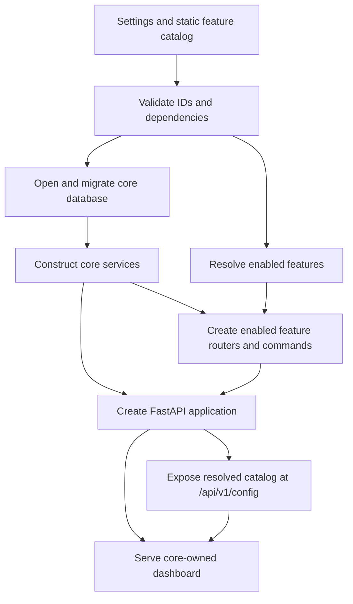

# First-party modular feature architecture plan

**Status:** Core architecture implemented 2026-09-08: static catalog, narrow services, lifecycle ownership and independent complete raw capture. Representative automated/browser verification and fixture measurements are recorded in the [architecture review](architecture-review.md). Performance acceptance remains partial: representative datasets and numerical budgets are still open. The design and phase criteria below remain the review reference; third-party process isolation is deferred.

AgentBoard is a first-party modular monolith for the foreseeable future. The dashboard, database, complete raw capture, HTTP application, configuration, and process lifecycle remain mandatory core capabilities. Analysis, evidence inspection, export, and continuation capabilities are optional first-party features selected by one process-wide allowlist. Ingestion sources are configured explicitly; every active source preserves complete raw data regardless of which analyses are enabled. There is no short-term third-party plugin system, marketplace, package discovery, or compatibility promise.

The implemented feature IDs, dependencies, defaults, and disable semantics remain defined in the [feature list](features.md). This document explains the architecture decisions, lessons from Grafana, VS Code and Obsidian, and the refactor acceptance criteria.

The [principles](principles.md) define the product intent behind this plan. [RAW-01 and PERF-01 acceptance criteria](specification.md#11-raw-capture-and-performance-acceptance) translate complete raw preservation and high performance into verification requirements. They supersede the earlier optional raw-retention design.

## Decision and scope

Use **feature** for a capability shipped, reviewed, tested, and released with AgentBoard. Reserve **plugin** for separately packaged third-party code if that is built later. Use **adapter** for a source-specific parser behind the core ingestion contract, which includes original source evidence as well as canonical `Session` and `Event` values.

The target has these ownership rules:

| Concern | Owner |
| --- | --- |
| SQLite schema, migrations, transactions, retention primitives | Core |
| Complete raw capture and source identity/encoding metadata | Core; independent of optional analysis and inspection |
| FastAPI application, middleware, route mounting, startup and shutdown | Core |
| Dashboard markup, styling, navigation, accessibility, and feature placement | Core |
| Feature catalog, dependency validation, resolved configuration | Core |
| Canonical session/event contract and correctness rules | Core |
| Optional analysis and feature-specific request handling | First-party feature module |
| Source normalization | First-party adapter behind the core ingestion contract |

This design deliberately excludes third-party code loading, feature-owned database migrations, arbitrary UI injection, hot enable/disable, per-user feature settings, and a separate extension process. Settings take effect after restart. Existing data is retained when a feature is disabled unless an explicit deletion or retention policy is added separately.

## Review findings and implemented corrections

| Finding before refactor | Implemented treatment and evidence |
| --- | --- |
| Optional retention discarded future source evidence; failed normalization rolled archives back | [Core capture](../backend/agentboard/ingestion.py) precedes interpretation for Codex and OTLP, with explicit outcomes and reprocessing. [Capture regressions](../backend/tests/test_capture.py). |
| Dynamic module loading exceeded first-party scope | Frozen [feature catalog](../backend/agentboard/features/catalog.py) and [adapter catalog](../backend/agentboard/adapters/catalog.py); plugin setting/hook removed. |
| Broad feature context exposed the application and raw store | [Named services](../backend/agentboard/services.py), individual [feature routers](../backend/agentboard/features/) and core route ownership checks. |
| Runtime construction and cleanup lacked an explicit owner | [Runtime](../backend/agentboard/runtime.py) manages HTTP/CLI resources and failure cleanup; [catalog/lifecycle tests](../backend/tests/test_feature_registry.py). |
| Analysis depended on the archive-inspection flag | `field_lineage` and `token_usage` now read mandatory core evidence without requiring `raw_archive`. [Feature/reimport coverage](../backend/tests/test_features.py). |
| Performance claims had no profile baseline | [Repeatable measurements and remaining gaps](architecture-review.md); complete capture is never treated as optional benchmark overhead. |

## What Grafana teaches

Checked against official documentation on 2026-09-08. Grafana distinguishes panel visualization, data-source integration and app plugins; a plugin's metadata declares its type, identity and dependencies. [Plugin types](https://grafana.com/developers/plugin-tools/key-concepts/plugin-types-usage), [metadata reference](https://grafana.com/developers/plugin-tools/reference/plugin-json).

Grafana separates registration from frontend loading and backend execution. Plugins with backends run as subprocesses managed by Grafana and communicate over gRPC using HashiCorp's plugin system; backend capabilities include queries, resource calls and health checks. Frontend-only plugins do not need that process. [Lifecycle](https://grafana.com/developers/plugin-tools/key-concepts/plugin-lifecycle), [backend system](https://grafana.com/developers/plugin-tools/key-concepts/backend-plugins).

UI extension points let app plugins register content while the consuming host decides how it is displayed. This is a useful ownership pattern for keeping a coherent UI. [UI extension concepts](https://grafana.com/developers/plugin-tools/how-to-guides/ui-extensions/ui-extensions-concepts).

**AgentBoard inference:** adopt explicit capability metadata, host-owned placement and lifecycle boundaries. Grafana's third-party distribution and backend process protocol solve a broader problem than this first-party prototype needs. Preserve those possible future boundaries without adding worker/RPC cost now. Grafana's extension design does not determine AgentBoard's collection policy; mandatory original capture follows our own principles.

## What VS Code teaches

VS Code separates static declarations, activation, APIs, UI contribution points, and runtime placement:

- Every extension has a manifest with a stable identity, version, compatibility range, entry point, activation events, and declared contributions. VS Code can inspect many contributions before executing extension code. See the official [extension anatomy](https://code.visualstudio.com/api/get-started/extension-anatomy) and [manifest reference](https://code.visualstudio.com/api/references/extension-manifest).
- Contribution points are core-defined slots for commands, settings, menus, views, languages, and other capabilities. The host decides how those declarations appear. See the [contribution point reference](https://code.visualstudio.com/api/references/contribution-points).
- Activation events defer executable work until a capability is needed. The extension exposes activation and optional deactivation hooks rather than controlling application startup.
- Extensions run in extension-host runtimes selected for local, browser, or remote execution. Extensions cannot access the workbench DOM directly; customized content uses constrained APIs such as webviews. See [extension hosts](https://code.visualstudio.com/api/advanced-topics/extension-host) and the [capabilities overview](https://code.visualstudio.com/api/extension-capabilities/overview).
- Process isolation has limits. Desktop extensions share an extension-host process, so one extension can still monopolize that host even though the main application is separated. VS Code documents this failure mode in its [high-CPU extension guidance](https://github.com/microsoft/vscode/wiki/Explain-extension-causes-high-cpu-load).

The useful lesson for AgentBoard is the ownership boundary: the host owns declarations, UI surfaces, compatibility checks, and lifecycle. Executable feature code receives a narrow host API. AgentBoard does not currently need VS Code's package manifest, marketplace identity, remote placement, web runtime, compatibility matrix, or extension host because all planned features ship in the same release.

VS Code's trade-off is architectural cost. Static contribution points and a host API protect the product and make thousands of extensions manageable, but every useful capability needs a designed contract. Cross-process calls, serialization, compatibility support, activation debugging, and shared-host contention add work that a small first-party system should not incur before it has external extensions.

## What Obsidian teaches

Obsidian uses a lower-friction model:

- A small `manifest.json` supplies identity, version, minimum application version, description, and whether the plugin requires desktop APIs.
- A bundled `main.js` exports a `Plugin` subclass. The plugin can access the central `App`, including `Vault`, `Workspace`, and `MetadataCache`, and can add commands, views, settings, status items, and event handlers. These capabilities are summarized in the official [Obsidian API repository](https://github.com/obsidianmd/obsidian-api).
- The base plugin API provides registration helpers for events, DOM events, and intervals so resources can be detached when a plugin unloads.
- Obsidian publishes explicit [plugin load-time guidance](https://docs.obsidian.md/plugins/guides/load-time) and [community plugin policies](https://docs.obsidian.md/community-directory/developer-policies), reflecting the operational cost of executing community code in the application environment.

This approach makes plugins easy to author and keeps calls local. It also gives plugin code broad access to application state, files, UI, DOM, and, for desktop-only plugins, Node.js or Electron APIs. Startup work and cleanup discipline are the plugin author's responsibility. A faulty plugin can therefore affect responsiveness, layout, data, or other plugins more directly.

The useful lesson for AgentBoard is ergonomic lifecycle management: feature modules should be simple, local, and easy to test, and resources registered during startup must have an owner and cleanup path. AgentBoard should not copy broad `App`/DOM/database access because the core has agreed ownership of those areas.

## Comparison and selected approach

| Design question | VS Code | Obsidian | AgentBoard decision |
| --- | --- | --- | --- |
| Discovery | Installed package manifests | Plugin folder plus manifest | Static catalog compiled into the release |
| Code origin | Third party and built in | Third party and built in | First party only |
| Activation | Declarative events and host activation | Plugin load/unload lifecycle | Activate only enabled features during startup; restart to change |
| UI | Core-defined contribution points; no workbench DOM access | Direct APIs and DOM access are possible | Core-owned fixed UI with declared feature visibility |
| Data | Stable host APIs | Broad app/vault access | Core services and repositories; no raw database handle |
| Runtime | One or more extension-host processes | Application/Electron environment | Same Python process |
| Isolation | Main UI separated; extensions in a host can affect one another | Low isolation | Trusted first-party code; no process boundary yet |
| Compatibility | Versioned external API contract | Manifest minimum app version and evolving API | One repository and release; internal interfaces may change together |
| Performance strategy | Declarative contributions and lazy activation | Author-managed load time | Do not import or initialize expensive disabled capabilities; measure before adding isolation |

AgentBoard adopts VS Code's declarative catalog, core-owned UI, narrow host interfaces, dependency validation, and activation discipline. It adopts Obsidian's simple in-process authoring and explicit resource cleanup. It defers both products' third-party distribution machinery.

## Target architecture



The startup order is intentional:

1. Read settings and the built-in catalog without importing optional service dependencies.
2. Validate unknown IDs, dependency cycles, and missing dependencies before opening SQLite.
3. Open the core database and run core-owned migrations.
4. Construct mandatory core services, including complete capture for configured ingestion sources, then only the optional services required by enabled features. For example, do not create the model gateway unless `classification` or `replay` is enabled.
5. Ask each enabled first-party feature for an `APIRouter` and any CLI command handlers, then let the core mount them.
6. Serve the mandatory UI and the resolved feature catalog.
7. On shutdown, close core resources and any registered first-party service resources in reverse construction order.

Configuration remains process-wide and immutable after startup. This makes API availability, UI state, storage behavior, and command behavior agree for the process lifetime.

### Static feature declarations

Replace the open-ended `Feature.register(context)` callback with a static first-party definition similar to:

```python
@dataclass(frozen=True)
class FeatureDefinition:
    id: str
    description: str
    default_enabled: bool
    requires: frozenset[str]
    router_factory: Callable[[FeatureServices], APIRouter] | None = None
```

The catalog is code in the AgentBoard package, not user-provided manifest data. It is safe to inspect for `agentboard features` without opening a database or importing optional model clients. Each ID is unique and matches `[a-z][a-z0-9_]*`. Dependencies form an acyclic graph and must be explicitly present in the allowlist; the runtime never enables them implicitly.

Use lazy imports inside a router or service factory for optional heavy dependencies. Declaration must be deterministic and free of I/O, environment mutation, threads, database access, and route registration.

### Core service boundary

A feature router receives only the service interfaces it needs. It does not receive the FastAPI application, mutable registry, raw `Store`, SQLite connection, or global runtime object. Example interfaces include:

- `SessionReader` for canonical sessions, events, and statistics.
- `IngestionService` for complete raw capture, adapter output, and explicit capture/normalization outcomes under core transaction policy.
- `ArchiveReader` and `LineageReader` for retained evidence.
- `UsageAnalyzer` and `ParallelAnalyzer` for optional calculations.
- `ClassificationService` and `ReplayService` for bounded model operations.
- `FeatureState` for read-only checks needed by combined capabilities such as raw export.

Core constructs these interfaces over `Store` and other shared resources. Feature code owns request/response mapping and feature-specific analysis, while core retains SQL, migrations, authorization middleware, concurrency limits, transaction policy, and canonical data rules.

Feature modules return `APIRouter` values. Only `api.py` includes routers in the application. This prevents a feature from altering middleware, exception handlers, static files, unrelated routes, or startup behavior.

### Database ownership

Core owns one schema and all migrations. Complete raw capture is unconditional for configured ingestion sources and preserves unknown fields/records for later interpretation. Preserve the source payload before lossy decoding or normalization; hashes and selected decoded attributes are insufficient. Capture and normalization failure semantics must preserve captured evidence and make incomplete capture explicit. Lossless compression or deduplication may reduce storage costs only while preserving exact reconstruction and source identity.

Optional feature tables may exist when a feature is disabled; table presence is an implementation detail rather than proof that the capability is active. Feature settings control these behaviors through core services:

- whether optional derived results or field-lineage mappings are calculated or retained;
- whether optional reads and exports are exposed;
- whether an expensive derived result is computed;
- whether previously retained data is reachable through feature routes.

Disabling an analysis or inspection feature never stops raw capture, drops tables, or deletes source history. Retained raw data must remain usable for later inference, calculation, and reparsing; enabling a feature does not itself promise automatic backfill. Data absent from older installations still requires the original source. Rollout fingerprints remain a core correctness mechanism alongside complete payloads. Exact current behavior, including capture and retry limits, is documented in [What disabling changes](features.md#what-disabling-changes).

### Adapter boundary

Adapters are first-party parser modules rather than plugins. A static `AdapterDefinition` identifies the adapter, its required import feature, and a lazy parser factory. The import HTTP route and CLI resolve adapters through the same catalog.

The ingestion contract must define source payloads and metadata, ordering, completion, and failure handling alongside canonical values. Today's Codex stream includes `RawLine` and `RawTraceEnd`; preserve their archive, fingerprint, and reconciliation semantics when separating capture from normalization. Core now captures OTLP before decoding can omit unknown data. Adapters do not write SQLite, mount routes, edit the UI, start background work, or choose whether to retain raw data. A future OpenCode, Pi, or Claude adapter should first ship and mature as a first-party module under these rules.

### Feature modules

The combined route installer has been split by capability. The responsibility mapping is:

| Feature | Module responsibility |
| --- | --- |
| `import` | HTTP/CLI import orchestration over enabled first-party adapters |
| `otlp_logs` | OTLP log receiver router and decode service |
| `otlp_traces` | OTLP trace receiver router and decode service |
| `raw_archive` | Optional archive inspection: raw import list, event evidence, and combined raw export routes; capture belongs to core |
| `field_lineage` | Session/event field-lineage routes |
| `unified_timeline` | Unified timeline route and optional parallel inclusion |
| `parallel_groups` | Overlap analysis route |
| `token_usage` | Usage, pricing, and combined usage export routes |
| `inputs` | Human-attributed input query route and UI tab |
| `export` | Normalized event export and shared export authorization |
| `classification` | Taxonomy, bounded classification input, model call, and saved result |
| `replay` | Edited-text replay route and service |
| `native_resume` | Plan route plus explicit CLI execution path |

Preserve existing feature IDs where practical, but explicitly migrate their semantics: `raw_archive` controls inspection/access only and can no longer disable capture. `field_lineage` and `token_usage` now access core raw data without requiring archive inspection. Document configuration changes rather than preserving the obsolete retention switch. There is no compatibility requirement for the experimental Python plugin API.

### Suggested source layout

```text
backend/agentboard/
  api.py                    # Core app, middleware, mandatory routes, UI mount
  config.py                 # Settings and allowlist parsing
  runtime.py                # Validation, service construction, shutdown
  store.py                  # Core schema, migrations, repositories
  capture_store.py          # Complete original payloads and attempt outcomes
  ingestion.py              # Shared capture-before-normalization policy
  http_ingestion.py         # Bounded admission and worker dispatch
  services.py               # Named feature operations
  features/
    __init__.py
    catalog.py              # Static FeatureDefinition values
    importing.py
    otlp_logs.py
    otlp_traces.py
    raw_archive.py
    field_lineage.py
    unified_timeline.py
    parallel_groups.py
    token_usage.py
    inputs.py
    export.py
    classification.py
    replay.py
    native_resume.py
  adapters/
    catalog.py              # Static AdapterDefinition values
    codex.py
frontend/
  index.html                # Core-owned optional containers
  app.js                    # Feature-aware state and requests
  style.css                 # Layout remains valid for every supported profile
```

This layout is a target, not a requirement to move unrelated modules. Refactor only files needed to establish the ownership boundary.

## UI alignment contract

The browser UI is always available and owned by core. Feature modules contribute data and routes, not HTML, JavaScript, CSS, arbitrary menu items, or DOM callbacks.

`GET /api/v1/config` remains the single runtime source of truth. It returns enabled IDs, the full built-in catalog, enabled adapter IDs, and optional taxonomy data. The UI follows these rules:

1. Optional containers are hidden in initial HTML to prevent unavailable controls flashing before configuration loads.
2. A container declares all required capabilities with `data-feature`. Hide the whole layout container so its removal leaves no empty grid cell, divider, heading, or tab stop.
3. Event handlers check the same capability before acting. Visibility is presentation; the backend's absent route remains the authority.
4. Data loaders never request a disabled endpoint. Optional promises are omitted rather than sent and ignored.
5. If a selected view becomes unavailable, the state machine moves to a valid core view before rendering.
6. Mixed capabilities require every relevant ID. Raw download requires `raw_archive` and `export`; usage download requires `token_usage` and `export`; branching requires `inputs` plus the selected continuation feature.
7. Core browsing has useful empty, loading, success, and error states when `features = []`.

UI review covers at least the empty allowlist, default tracing profile, one selective ingestion profile, and the model-feature profile. Check desktop and narrow widths, keyboard order, focus after hidden controls change, headings, spacing, empty states, and the browser network log. Use the isolated dev configuration on port 4319 and Codex's in-app browser.

## Disable contract

Every optional feature is reviewed across four boundaries:

| Boundary | Required disabled behavior |
| --- | --- |
| HTTP and OpenAPI | Routes are not mounted and do not appear in the schema; direct requests return 404 |
| CLI | Commands or modes fail before opening/migrating the database when possible, with the missing feature named |
| UI | Controls and containers are absent from layout and tab order; no request targets disabled routes |
| Runtime and storage | Optional clients, derived parsing/calculations, background work, and derived persistence are skipped; complete raw capture from configured sources continues |

Complete raw capture remains mandatory even if all analysis features are disabled. Timestamp normalization, input attribution, event identity, stale-lineage cleanup, and rollout fingerprints also protect correctness of the shared dataset. Disabling a display or analysis workflow does not redefine canonical events or remove the original evidence needed for future calculations. Source/receiver selection remains explicit: an empty allowlist does not start unconfigured collection, and isolated development must not receive continuous telemetry.

## Performance plan

High service performance is required while prototyping in Python. The first-party in-process design avoids RPC, serialization, a worker supervisor, and one extra runtime per feature. It should have little disabled-analysis overhead beyond mandatory capture and core correctness work, but that must be demonstrated rather than assumed. Preserve boundaries for replacing measured bottlenecks later; no replacement language or rewrite is selected.

Enforce these structural rules:

- Disabled feature router and service factories never run.
- Model clients load only for enabled model features.
- Complete raw archival always runs for configured ingestion; optional field-lineage mapping, parallel grouping, usage scanning, and unified correlation run only when needed.
- Keep capture bounded and efficient through batching, streaming, and measured storage/index improvements. Defer expensive optional inference and calculation from ingestion.
- Under capacity pressure, use explicit backpressure or failure; never acknowledge success after silently sampling, truncating, or dropping source data.
- No feature dispatch occurs for every event after startup. Ingestion calls core services directly with resolved policy.
- No feature starts an unbounded thread, timer, watcher, or background queue. Any future resource registers a core-owned shutdown callback.
- UI code issues no speculative disabled-feature requests.

Record baselines before and after the refactor for startup time, resident memory, CPU, disk growth/write volume, core session/event query latency, ingestion throughput in bytes/events, tail latency under concurrent ingestion/queries, and default-profile request count. Use fixed fixtures and record raw completeness with the measurements; an old profile that drops source data is not an equivalent workload. Compare `features = []` over an existing dataset, configured ingestion with optional analysis disabled, the default tracing set, and model features enabled. No numerical capacity claim or regression threshold is selected yet; establish repeatable measurements, then record a budget under PERF-01 in the specification. High-volume infrastructure remains a separate backlog item.

## Implementation sequence

Phases 1–5 are implemented. Phases 0/6 have fixture measurements and recorded verification; representative performance coverage and budgets remain open as detailed in the review. The criteria below preserve the implementation sequence and continuing acceptance obligations.

### Phase 0 — Record capture contracts and performance baselines

- Define raw payload/metadata formats and explicit capture, normalization, failure, and retry semantics for Codex imports and OTLP.
- Record the current revision, fixed fixtures, raw completeness gaps, and performance measurements before refactoring.

**Exit:** The required original evidence and baseline workload are explicit; existing loss is recorded rather than treated as a valid optimization.

### Phase 1 — Retire the experimental public plugin surface

- Remove `Settings.plugins`, `AGENTBOARD_PLUGINS`, dynamic `importlib` discovery, and user-supplied `register(registry)` calls.
- Remove the example external extension and plugin-specific configuration/documentation.
- Rename public wording from “feature list and plugins” to “configurable features.”
- Retain allowlist resolution, dependency errors, and enabled adapter reporting; document the planned raw-capture and dependency changes for HTTP and CLI.

**Exit:** No configuration value can execute an arbitrary Python module. Current behavior docs no longer advertise a third-party or trusted-plugin contract.

### Phase 2 — Establish the static catalog

- Introduce immutable `FeatureDefinition` and `AdapterDefinition` values for shipped code.
- Separate declaration and validation from service construction.
- Keep `agentboard features` free of database creation and optional dependency imports.
- Validate unknown IDs, duplicates, cycles, missing dependencies, and adapter ownership with focused tests.

**Exit:** HTTP and CLI derive the same resolved catalog entirely from shipped declarations.

### Phase 3 — Establish core capture and narrow feature services

- Move complete raw capture behind core services for every configured source, including full OTLP payloads; remove the `raw_archive` retention gate.
- Preserve captured evidence across interpretation failures, report outcomes explicitly, and verify retries and later reparsing.
- Limit `raw_archive` to inspection/access and revise dependencies on it; use the same ingestion contract for HTTP and CLI.
- Move each installer from `feature_routes.py` into its owning module.
- Return `APIRouter` instances instead of mutating `context.app`.
- Replace direct `context.store` access with the smallest core service interface needed by each module.
- Keep middleware, core routes, static files, model error translation, and app state in core.

**Exit:** Optional features cannot disable raw capture through their supported interfaces; complete payloads support later processing. Feature handlers use narrow services without a raw database handle.

### Phase 4 — Make lifecycle and initialization explicit

- Build optional services only after configuration validation and only for enabled features.
- Represent cleanup using core-owned context managers or shutdown callbacks.
- Ensure construction failure closes previously created resources and prevents the server from accepting traffic.
- Keep restart as the documented way to change capabilities.

**Exit:** Startup and shutdown order is deterministic, and disabled expensive dependencies are neither initialized nor contacted.

### Phase 5 — Bind UI and API capability contracts

- Keep optional markup in the core frontend and annotate feature containers consistently.
- Add a test that every frontend feature ID exists in the backend catalog.
- Generate or inspect valid feature combinations, checking hidden layout, guarded actions, and requested URLs.
- Verify representative profiles in the in-app browser using isolated data.

**Exit:** The UI presents no unavailable action and preserves a coherent core dashboard for an empty allowlist.

### Phase 6 — Measure and reconcile documentation

- Repeat Phase 0 measurements with complete raw capture, compare equivalent workloads, and record performance budgets or unresolved measurement gaps.
- Run backend, frontend, lint, package-build, and documentation-link checks.
- Update the feature list, architecture, specification, development guide, examples, and backlog to describe the implemented target.
- Mark this plan implemented only after its acceptance criteria pass.

**Exit:** Current-behavior documentation matches code and includes measured performance results or an explicit unresolved measurement gap.

## Verification matrix

| Area | Required evidence |
| --- | --- |
| Catalog | Unknown, duplicate, cyclic, and missing dependencies fail before storage opens |
| Empty profile | Core health/config/session/event/stats/UI work with `features = []` |
| HTTP | Each disabled feature's routes and OpenAPI entries are absent |
| CLI | Feature-gated operations reject disabled capabilities through the shared runtime |
| UI contract | Hidden containers leave no gaps or tab stops; disabled endpoints receive no browser request |
| Raw capture | Complete supplied payloads survive disabled analysis/inspection, unknown fields/records, and interpretation failures; incomplete capture fails explicitly |
| Derived persistence | Disabled lineage and analysis skip derived writes while raw data and canonical reconciliation remain intact |
| Future processing | Retained raw payloads can be reparsed after a feature or mapping change; exact reconstruction and source identity remain verifiable |
| Computation | Parallel, usage, lineage, unified, and model work is skipped when disabled |
| Dependencies | Every supported combined operation requires its complete feature set |
| Lifecycle | Enabled resources initialize once and close once; partial startup failure cleans up |
| Packaging | Wheel contains the catalog, first-party modules, and complete static UI |
| Performance | Fixed profiles report throughput, query/tail latency, CPU, memory, disk, and request counts alongside complete raw-capture verification |

Do not test every mathematical subset of 13 features. Generate dependency-valid single-feature and dependency-chain cases, then add representative combinations for shared routes and UI layout. This gives direct boundary evidence without a large redundant suite.

## Risks and controls

| Risk | Control |
| --- | --- |
| Feature modules become thin names around one coupled application | Enforce router and service boundaries; keep pure analysis functions independently testable |
| A large generic service context recreates global access | Inject only feature-specific protocols; review additions to shared interfaces |
| UI and backend feature names drift | Catalog-to-frontend contract test plus browser network inspection |
| Feature switches or optimizations discard future evidence | Keep raw capture mandatory; verify exact payload reconstruction and reimports across analysis/inspection profiles |
| Too many small files obscure request flow | Keep one obvious catalog and mapping table; avoid framework layers without an ownership purpose |
| Optional dependencies still hurt startup | Use lazy factories and measure imports, startup time, and memory |
| Retained data surprises operators | Keep disable semantics explicit; treat deletion and redaction as separate future policies |
| First-party APIs are prematurely frozen | Keep feature interfaces internal until a real external consumer requires stability |

## Deferred third-party design

Revisit third-party plugins only after a concrete external integration cannot reasonably ship and release with AgentBoard. At that point, require a separate proposal covering package identity, API versioning, permissions, installation, upgrades, failure recovery, observability, support policy, and removal.

The default third-party execution model should be a supervised separate process with a small, versioned RPC contract. Use coarse operations such as paged session reads, bounded session snapshots, streamed adapter batches, analysis requests/results, cancellation, and health checks. Avoid one RPC per event. Core continues to own database access, migrations, UI rendering, authentication, and lifecycle decisions. UI contributions should be declarative data rendered in core-owned surfaces.

Process separation adds startup time, memory, serialization, and IPC latency. It provides a meaningful crash and permission boundary only when paired with timeouts, resource limits, protocol validation, and restricted filesystem/network access. A shared worker resembles VS Code's extension host and reduces resource cost, but one plugin can delay peers; a worker per plugin improves fault attribution at greater cost. Choose from measurements and threat requirements rather than adopting either layout by default.

Any future in-process integration is explicitly trusted first-party or deployment-specific code. Direct database access would bypass the ownership and migration contract, so it requires a separate architectural decision and should not be presented as ordinary plugin support.

## Acceptance criteria for the target design

- The mandatory dashboard and core browsing API work with an empty allowlist.
- One static first-party catalog defines every optional capability used by HTTP, CLI, adapters, and UI discovery.
- Configuration contains no module names and cannot load user-selected executable code.
- Invalid configuration fails before database creation or migration.
- Enabled feature modules return routers and use narrow core services; they do not receive the application or raw store.
- Disabled analysis/inspection features mount no routes, initialize no optional clients, trigger no UI requests, and perform no optional derived calculation or persistence; complete raw capture from configured sources continues.
- Complete raw payloads and reprocessing metadata survive unknown records and interpretation failures; incomplete capture is reported explicitly. Retained data supports later inference/calculation without relying on the original source remaining available.
- The core owns all schema migrations, UI markup/style/navigation, authentication, concurrency controls, and startup/shutdown.
- Existing data remains readable according to the documented core and enabled-feature contracts; re-enabling does not imply backfill.
- Backend, frontend, reimport, packaging, and isolated browser checks pass for representative profiles.
- Performance measurements cover complete raw ingestion and concurrent queries in the Python prototype; resource/latency budgets or remaining measurement gaps are recorded explicitly.
- Documentation distinguishes the implemented first-party system from the deferred third-party proposal.

## Decision record

| Date | Decision |
| --- | --- |
| 2026-09-07 | Keep the UI mandatory and make tracing/analysis capabilities process-wide optional features. |
| 2026-09-07 | No third-party plugins are planned in the short term. Features ship with AgentBoard in one repository and release. |
| 2026-09-07 | Core owns the database, UI, configuration resolution, and lifecycle. |
| 2026-09-07 | Replace the experimental dynamic Python plugin hook with a static first-party catalog and router/service boundaries. |
| 2026-09-07 | Defer process isolation and RPC until a concrete third-party requirement exists; use separate-process execution as the default proposal when that work begins. |
| 2026-09-08 | User requires complete raw collection for future inference and calculation. Raw capture is mandatory core behavior; this supersedes optional raw retention and narrows `raw_archive` to inspection/access. |
| 2026-09-08 | User requires high service performance while prototyping in Python. Measure and optimize now without sacrificing raw completeness; defer language replacement to demonstrated needs. |

| 2026-09-08 | Architecture review implemented core capture (schema v9), static first-party features and named services, shared lifecycle, revised dependencies and explicit reprocessing. Record verification/performance limits in the review. |
