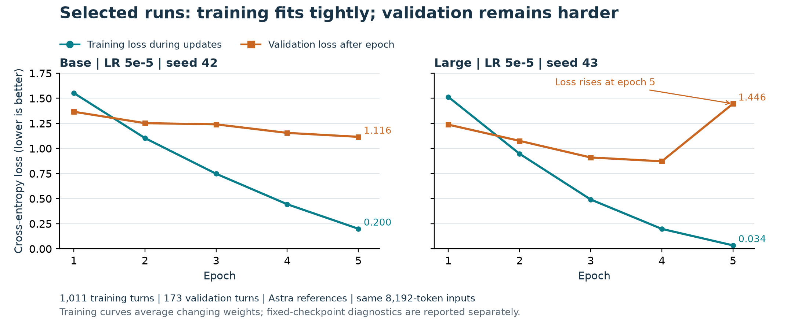
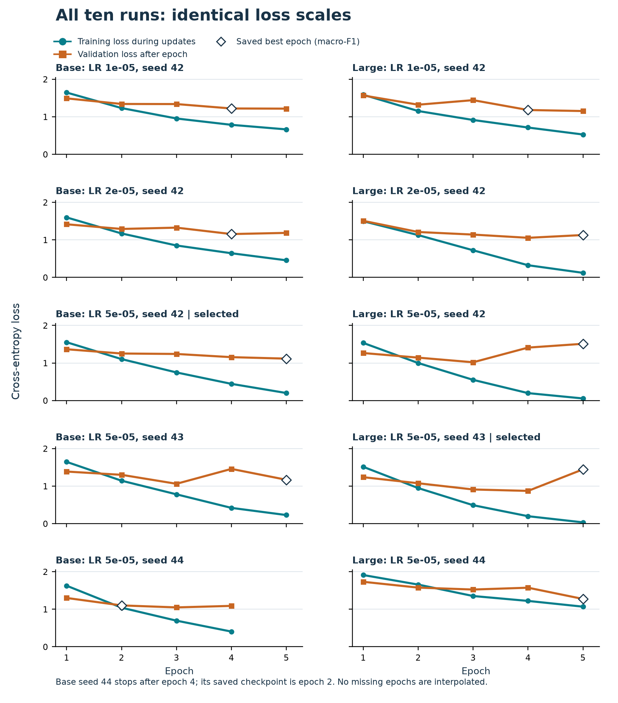
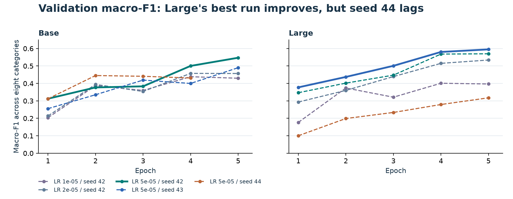

# ModernBERT Base vs Large

Training comparison and fit analysis | 29 September 2026

The [4 October follow-up](turn-classifier-run.md#incremental-inference-through-3-october-2026) evaluates these frozen checkpoints and eight GPT configurations on 484 newly imported turns. The training analysis below retains its original cohort and measurements.

**Finding:** the selected Large checkpoint improves agreement with Astra, but does not remove the generalization gap. Both selected models fit the training labels closely. Large shows a pronounced validation-loss increase at epoch 5 and much greater variation across seeds.

| Selected-checkpoint metric | Base | Large | Change |
| --- | --- | --- | --- |
| Validation agreement | 68.21% | 73.99% | +5.78 pp |
| Validation macro-F1 | 0.5472 | 0.5950 | +0.0479 |
| Reused test agreement | 61.54% | 75.71% | +14.17 pp |
| Reused test macro-F1 | 0.4978 | 0.6369 | +0.1391 |

Validation: 173 turns / 36 groups. Test: 247 turns / 36 groups. Accuracy means agreement with inferred Astra labels, not human-verified correctness. The previously inspected test set is a retrospective comparison, not a fresh holdout.

### What the experiment held constant

| Item | Recorded setting |
| --- | --- |
| Data | 1,011 train / 173 validation / 247 test turns; saved Astra xhigh labels |
| Split | Chronological, whole-session/fork groups; exactly the same turns and retained tokens |
| Input | Target turn first, then immediate predecessor; right truncation at 8,192 tokens |
| Objective | Eight-class cross-entropy; no class weights or label smoothing |
| Optimization | AdamW, weight decay 0.01, effective batch 16, 10% warmup, linear decay |
| Search | LR 1e-5 / 2e-5 / 5e-5 at seed 42; winning LR repeated at seeds 43 and 44 |
| Stopping | At most five epochs; stop after two checks without improvement under the selection rule |
| Selection | Highest eight-class validation macro-F1, then lower validation loss; test excluded |
| Selected | Base: LR 5e-5, seed 42, epoch 5. Large: LR 5e-5, seed 43, epoch 5. |

This report uses all ten saved histories: 24 completed Base epochs and 25 Large epochs. It adds fixed-checkpoint train/validation evaluation only. No new training, relabeling, test predictions or serving-checkpoint changes were performed.

## Loss curves and fit diagnosis

Selected runs, with common axes. Points are recorded epochs; lines are unsmoothed. The selected runs use different seeds.

| Fixed-checkpoint diagnostic | Base | Large |
| --- | --- | --- |
| Training agreement | 96.54% | 99.80% |
| Validation agreement | 68.21% | 73.99% |
| Training cross-entropy | 0.107714 | 0.005776 |
| Validation cross-entropy | 1.115973 | 1.446361 |
| Train minus validation agreement | 28.33 pp | 25.81 pp |
| Validation disagreements with top score >= 0.90 | 15 of 55 | 21 of 45 |

Both diagnostics use eval mode, no gradients, BF16 autocast and batch size 2. Training-curve loss averages changing weights during updates; it is not the same measurement as fixed-checkpoint training loss. Large's original validation used batch 16: its saved loss is 1.445890 versus 1.446361 here; category agreement and macro-F1 match.

**Base: a substantial generalization gap, not strong evidence of capacity underfitting.** It correctly matches 976/1,011 training labels versus 118/173 validation labels. However, its selected run's validation loss still falls from 1.155 to 1.116 at epoch 5. The curve does not establish that its optimal stopping point has already passed. See the standard [train/validation fit patterns](https://scikit-learn.org/stable/modules/learning_curve.html).

**Large: strong late-epoch loss overfitting despite better classification.** It matches 1,009/1,011 training labels and 128/173 validation labels. From epoch 4 to 5, training-curve loss falls 0.198 to 0.034, while validation loss rises 0.872 to 1.446. Agreement improves by only one turn; macro-F1 rises 0.5803 to 0.5950.

[Cross-entropy](https://docs.pytorch.org/docs/2.14/generated/torch.nn.CrossEntropyLoss.html) penalizes low probability assigned to the reference class, whereas accuracy counts only the highest-scoring category. Large has fewer validation disagreements but more with top scores >= 0.90. This supports concern about overconfident disagreements; formal calibration was not measured. Temporal distribution shift and imperfect labels can also contribute to the gap.

## Loss curves for every run

The diamond marks the checkpoint selected by validation macro-F1, not the minimum validation loss. All panels share 0-2.05 loss limits. Base seed 44 ended after epoch 4; no fifth epoch is invented.

The weakest Large run (seed 44) still has training loss 1.068 and validation loss 1.274 at epoch 5. That run shows incomplete learning or optimization difficulty, unlike the selected Large run. This does not establish that the Large architecture lacks capacity.

## Repeatability and checkpoint selection

Solid lines identify each model's selected run. Dashed lines are other candidates. The metric averages all eight categories, including zero-F1 categories.

| Model | LR | Seed | Best epoch | Val. acc. | Val. F1 | Val. loss |
| --- | --- | --- | --- | --- | --- | --- |
| Base | 1e-05 | 42 | 4 | 57.23% | 0.4384 | 1.2202 |
| Base | 2e-05 | 42 | 4 | 60.12% | 0.4576 | 1.1547 |
| Base * | 5e-05 | 42 | 5 | 68.21% | 0.5472 | 1.1160 |
| Base | 5e-05 | 43 | 5 | 65.90% | 0.4902 | 1.1687 |
| Base | 5e-05 | 44 | 2 | 60.69% | 0.4452 | 1.1015 |
| Large | 1e-05 | 42 | 4 | 55.49% | 0.4010 | 1.1795 |
| Large | 2e-05 | 42 | 5 | 71.10% | 0.5341 | 1.1290 |
| Large | 5e-05 | 42 | 5 | 70.52% | 0.5699 | 1.5111 |
| Large * | 5e-05 | 43 | 5 | 73.99% | 0.5950 | 1.4459 |
| Large | 5e-05 | 44 | 5 | 58.38% | 0.3175 | 1.2737 |

* Final selected model. Rows report the saved best epoch, not necessarily the last epoch trained. Base seed 44 stopped after epoch 4 and retained epoch 2.

| LR 5e-5, three seeds | Mean best F1 | Sample SD | Range |
| --- | --- | --- | --- |
| Base | 0.4942 | 0.0511 | 0.4452 - 0.5472 |
| Large | 0.4941 | 0.1535 | 0.3175 - 0.5950 |

**Best-case quality improves; average repeat-seed quality does not.** The three-seed means are almost identical (about 0.494), while Large's sample standard deviation is about three times Base's. Three seeds are descriptive evidence, not enough to estimate robustness precisely. Large seed 44 must remain in the comparison.

The chosen Large epoch 5 follows the predeclared macro-F1 criterion. Epoch 4 has better validation loss, but choosing it now would change the objective after inspection. Earlier epoch weights were overwritten when a later best checkpoint was saved; their curves are available, but their test behavior was not measured.

## Compute trade-offs and class coverage

| Recorded measurement | Base | Large |
| --- | --- | --- |
| Recorded training time, all five runs | 54.46 min | 33.95 min |
| Completed epochs, all runs | 24 | 25 |
| Peak CUDA allocation, full runs | 6.15 GB | 32.08 GB |
| Peak reserved CUDA + process RSS | Not recorded | 48.65 GB |
| Warm inference median / p95 | 17.28 / 35.78 ms | 22.48 / 42.31 ms |
| Warm serial inference throughput | 51.90 turns/s | 40.43 turns/s |
| Cold model load | 4.29 s | 7.80 s |

Large's faster training came with changed execution settings: FlashAttention 2, fused AdamW, no gradient checkpointing, and physical batches up to 16 / 32,768 padded tokens. Base used SDPA, checkpointing and microbatch 2. Effective batch stayed 16. This is not an isolated benchmark of model size, nor an architecture-only quality ablation.

Recorded training time includes epoch training, validation and checkpoint writes; it excludes initial loading, smoke, final evaluation and archiving. Inference uses batch 1 / concurrency 1 on each model's configured backend, excluding HTTP overhead. The unified-memory RSS sum is conservative and may double-count allocations; Base's missing RSS measurement is not zero.

The selected Large speed configuration was 3.68x faster than conservative Large training in a six-update benchmark (1.45 versus 5.32 seconds/update). Full-length stress reached a conservative 59.20 GB; real training peaked at 48.65 GB. Docker memory was capped at 80 GB and the CUDA allocator at 60 GB. Two larger profile candidates hit the allocator cap and were rejected; all full training runs completed.

### Retrospective test macro-F1 by category

| Category | Test support | Base F1 | Large F1 |
| --- | --- | --- | --- |
| writing | 14 | 0.5000 | 0.6875 |
| coding | 79 | 0.7273 | 0.8571 |
| bug-fixing | 15 | 0.4348 | 0.7059 |
| research | 25 | 0.5882 | 0.6364 |
| analysis | 31 | 0.6087 | 0.8214 |
| creative-media | 1 | 0.0000 | 0.0000 |
| guidance | 56 | 0.6531 | 0.7347 |
| other | 26 | 0.4706 | 0.6522 |

There are only four creative-media training turns and one each in validation/test. Both models miss the sole test example; broader quality for that category is unknown. Macro-F1 weights each category equally, so rare classes can strongly affect selection.

## Limits, next experiments and provenance

### What the evidence does and does not establish

The selected Large checkpoint has stronger reference agreement on these fixed splits. It is not established as consistently better across seeds, better calibrated, or better on future sessions. Validation was used repeatedly for model selection, and the test set had already been inspected before the Large follow-up.

The 1,431 turns come from 247 sessions / 239 groups. Whole sessions and recorded forks stay together, but their time ranges overlap partition boundaries. Unrecognized near duplicates, chronological distribution shift and noisy Astra labels remain possible. Four training turns were truncated; validation/test contain no truncated or empty targets, so those deployment cases remain untested for quality.

Saved group-bootstrap 95% intervals for test macro-F1 are Base 0.4269-0.5474 and Large 0.5557-0.6864 (1,000 whole-group resamples each). They are separate descriptive intervals, not a paired difference test, and do not correct test reuse, model selection or label errors. Softmax calibration and formal bias/variance decomposition were not performed.

### Proposals - no new training launched

1. Repeat matched seeds and learning rates before attributing the improvement to model size. Keep seed 44 failures visible and report means, dispersion and selected checkpoints.

2. Run a bounded regularization/checkpoint experiment on validation data, with the selection rule declared in advance. Retain every epoch checkpoint so a lower-loss earlier epoch can be compared without reconstructing discarded weights. More epochs alone are not supported as the main remedy for the selected Large run.

3. Reserve genuinely later, session-disjoint data for a fresh evaluation and review rare-category/reference disagreements. Label or weighting changes should be separate, recorded experiments.

### Evidence and reproduction

Comparison report archive: e7232cc9-d861-4894-b03d-de3cfb1b52da

Base archive: 4ee47359-3685-42e7-80d6-f53e1aafa827
Large archive: a4648866-3edd-42dc-8fb8-d32803320051
Base checkpoint SHA-256: 6b1377cd02d3db9dd3a16b3d37298108e0d23780e14188659cdf3065540d0172
Large checkpoint SHA-256: b32dd71138af35cd4f62f11e2e38239108595907ac57736a3767c1f25f5f69bd

Source artifacts: each archive's outputs/selection.json, outputs/lr-*/history.json, outputs/lr-*/manifest.json, outputs/evaluation/report.json and inputs/dataset/. Both complete archive inventories were hash-verified; split membership, labels and retained IDs matched exactly. New diagnostics are timestamped in comparison.json. Full transcripts and per-turn predictions remain private on Spark.

Reproduction bundle: comparison.json, collect_metrics.py, plot_figures.py, build_report.py, figures and this report. Documentation retains PNG figures only; the saved raw data and plotting script support regeneration, so SVG copies are not required. Plotting uses Matplotlib 3.11.2; PDF generation uses ReportLab 4.4.9. Source weights are pinned in comparison.json; both experiments use Transformers 4.57.6 and the recorded NVIDIA PyTorch image. Operational commands remain in docs/turn-classifier-run.md.

Method references: [scikit-learn validation curves](https://scikit-learn.org/stable/modules/learning_curve.html) explains train/validation fit patterns and selection bias; [PyTorch cross-entropy](https://docs.pytorch.org/docs/2.14/generated/torch.nn.CrossEntropyLoss.html) defines the loss. Fit judgments here are inferences from this experiment's measured curves, not diagnoses established by those references.

See the [execution workflow](turn-classifier-run.md) for data preparation, speed-profile settings, service ports and reproducible launch commands.
